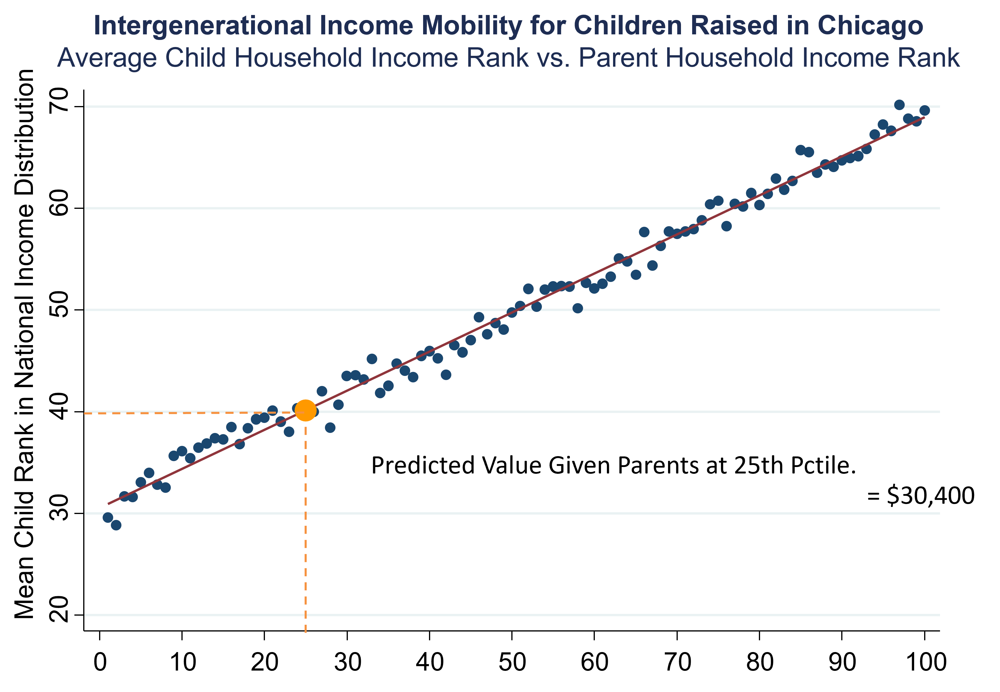
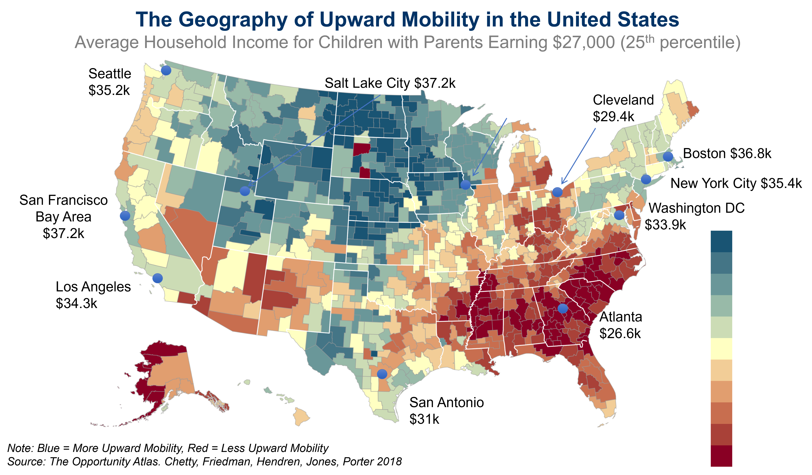

# (PART) Ec. & Soc. Issues {-}

# Upward Mobility in the US {#lec1_geomobility}

We will first dive into a relatively recent (from 2020) called “The Opportunity Atlas: Mapping the Childhood Roots of Social Mobility.”, by Chetty, Friedman, Hendren, Jones and Porter. The previous link should take you to Blackboard where you will be able to download it. 

The main question in the paper is the following: 'how do children's chances of moving up vary across areas in America?'

To answer it, the authors need to measure upward mobility across the country. How do they do that? They will construct a database called the [Opportunity Atlas](https://www.opportunityatlas.org/). 

How do they measure upward mobility separately by geographic area in the United States? They take data from the 2000 and 2010 Censuses, and link that to information from federal income tax returns. They also use tax return data from 1989 to 2015. Linking those datasets yields information on essentially every American between 1989 and 2015, including how much they are earning, where they live, the dependents they have, and other information, year by year. 

In that dataset, they want to study economic opportunity across generations. But that requires knowing in the data who is the children of whom. In order to link parents to their children, they use information from dependency claims on tax returns. (In order to receive a tax deduction, parents must enter their child’s Social Security Number on their tax returns.) They're able to use this information to link 99% of kids in America back to their parents, thereby generating an intergenerational sample where you can study income inequality and mobility across generations. There is a lot you can learn about the US and economic mobility with that sort of data!

At the end, they end up with an 8-billion row dataset which covers 20.5 million children born between 1978 and 1983, representing 96% of our target population. They analyze children born during those particular years because we need the children to be old enough that we can measure their earnings reliably.

They're interested in people who were born in the U.S. or are authorized immigrants who came to the U.S. in childhood. They are focusing on authorized immigrants because these datasets don't go a great job of covering undocumented immigrants. Note here that this is a limitation for the study only in the sense that it does not necessarily paint a picture of how economic mobility looks for undocumented immigrants. Additionally, the number is not 100% because there are some kids who you can't link to their parents and people you can't link the census form to the tax form. 

How do they measure parents’ and children’s incomes in tax data? They do so by measuring incomes using information from the anonymized tax return data. For parents, they use average income between 1994 and 2000 reported on Form 1040, the main tax return in the U.S. Similarly, for kids, we measure average income in 2014 and 2015, the last two years of the data theyworked with. That is when the children are in their mid-30s.

Using this information, they're going to focus on percentile ranks in the national [distribution](#appDistributions). What that means, concretely, is that they rank kids relative to all the other kids born in the same year, and parents relative to all other parents. They are comparing kids to other kids of the same age. Then likewise, they compare parents to other parents. The reason is that because they want to adjust for the fact that as people grow older, their incomes tend to rise. 

## Parental and children income rank

The chart below was constructed using data for kids who were raised in the Chicago metro area, which consists of Chicago and the surrounding suburbs.

```{r chicagoMob, fig.cap="Source: Chetty, Hendren, Kline, Saez (2014)", echo=FALSE, out.width = '90%'}

```

Let's interpret the figure. On the x-axis, it shows the parent rank in the national income distribution. There are a hundred dots here, one corresponding to each percentile of the distribution (see [here](#appPercentiles) for a refresher on what the percentiles are). Then in each of those hundred bins, we're plotting the average ranking of the child in the national income distribution. Now as you go to the right, you're looking at kids from richer and richer families, and you see that there's a very strong upward-sloping pattern. This reflects the simple fact that if you were born to a richer family in America, you yourself tend to be richer in adulthood.

Now let's find the **line** that fits that data most accurately using a method called regression. Then I'm going to focus on the value of this line, called the *predicted value*, at the 25th percentile of the parent income distribution. There is a lot of information contained in each dot in the graph, but by focusing on the value of this line we can construct a digestible **single statistic** (i.e., a number) summarizing what upward mobility looks like in each place. 

## Interpreting the regression line

In Chicago, on average, kids who start out in families at the 25th percentile end up at the 40th percentile. Kids growing up in low-income families in Chicago, roughly speaking, earn about $30,000, on average, when they're adults. We can’t directly use the value of the dot on the above chart at the 25th percentile. Instead we use a regression line. This is because there is noise and random variation in the data, specifically with smaller samples of people.

When working with small samples, it starts to become very important to fit that regression line. That is, we need to use the discipline of a statistical model. That's the core idea of statistical models, to take the underlying data and represent it in a way that is more stable.

### Percentiles

The conversion to percentiles is very important here.  If we did this analysis in dollars, that relationship is very far from linear. It is very curved, which makes it harder to fit systematically with a statistical model. 
To construct the Opportunity Atlas, we fit line like this to the kids who grew up in every different census tract in America. 

### What is a tract?

A Census tract is a small definition of a neighborhood that the Census Bureau has created. There are 70,000 Census tracts in America, each of which has about 4,200 people. In order to handle children who might have moved while they were kids, we weigh children by the fraction of their childhood that they spent in each area. 

## Geographic Variation in Upward Mobility by Commuting Zone

The map below plots average household earnings of children who grew up in low-income families.  The map presents this statistic separately for each of the 741 commuting zones (CZs) in the United States. CZs are aggregations of counties based on commuting patterns that are similar to metro areas but cover the entire United States.  

```{r mobCZ, fig.cap="Source: Chetty, Friedman, Hendren, Jones and Porter (2018)", echo=FALSE, out.width = '90%'}

```

Note that the map shows household income in dollars, but the underlying statistic is based on the predicted percentile rank defined earlier.  The ranks have been converted to dollars because it's more intuitive and concrete.  
 
In the map, blue colors depict areas with high levels of upward mobility and red colors depict areas with low levels of upward mobility. The map shows broad geographic variation.  One of the most interesting features of this map is that the highest upward mobility areas in America are the Great Plains, the rural parts of the country in the center of the country. 
Charlotte is one of the cities in America with the highest rates of job growth in the United States. Yet, somehow remarkably, for low-income kids who grow up in Charlotte, they do not have very good chances of moving up. 

The map shows that in the current generation, there are some parts of America where kids' chances of moving up still look fantastic—actually better than any other country in the world. Then there's some places, like in much of the industrial Midwest, where your odds of climbing up look worse than any country for which we currently have data. America is a land of tremendous variability in opportunity. 

### Adjustments for cost of living

This map shows nominal incomes, meaning it does not adjust for differences in cost of living. You can redraw this map, adjusting for differences in cost of living. When you do that, you get a map that looks almost identical to the one that I'm showing you here. To put it more precisely, the correlation between that data and these data is .9, meaning that it looks essentially the same. 

We're focusing specifically here on kids growing up in low-income families. If you look at kids growing up in middle-class families, it's broadly similar. If you look at kids growing up in high-income families, you see that there's significantly less variation across areas for kids growing up in very-high-income families. 

## Local Area Variation in Upward Mobility: Los Angeles, CA 

This geographic variation in upward mobility is not just about broad regional variation, but it's actually about extremely local variation.  We can use the Opportunity Atlas to visualize the data. 

```{r , fig.cap="Incarceration Rates for Black Men Raised in the Lowest-Income Households in Los Angeles, CA", echo=FALSE, out.width = '90%'}
knitr::include_graphics("images/la_incratesblack.png")
```

The Opportunity Atlas starts out with the national map of the same statistics by commuting zone that we were looking at before. However, it allows us to zoom in to areas of specific interest.  Let us focus on one particular example: Nickerson Gardens in Los Angeles, CA, which is a public housing project in Watts. Let's look at black men growing up in the lowest-income families in the bottom 1% of the income distribution, which is actually representative of the incomes of the families living in this public housing project. The average household income of black men who grew up in the poorest families in Watts is just $3,300 a year. It has to be the case that lots of people are basically not working at all. You can see that in a very direct way in these data because we're able to look not just at income, but a variety of other outcomes, including incarceration. 

Focusing on incarceration rates, you will see a really shocking and disturbing statistic about the United States, and this area in particular, which is that 44% of the black men who grew up in these lowest-income families are incarcerated on a single day, the date of the 2010 census. If you go down to Compton, you see incarceration rates of 6.2%, which is a factor of 10 smaller than the 44% that we were seeing in Watts for black men growing up in low-income families. Compton is a different neighborhood than Watts, it's not exactly the same, but I don't think anybody from L.A. would have predicted that Compton would have drastically different outcomes like this from Watts.

That shows you that you can go two miles away and just have a dramatically different picture in terms of what kids' life trajectories look like. We see that in the stark example here within Los Angeles, but we see that sort of thing more broadly across the United States. 

<!--
## Captioned figures and tables

Figures and tables *with captions* can also be cross-referenced from elsewhere in your book using `\@ref(fig:chunk-label)` and `\@ref(tab:chunk-label)`, respectively.

See Figure \@ref(fig:nice-fig).

```{r nice-fig, fig.cap='Here is a nice figure!', out.width='80%', fig.asp=.75, fig.align='center', fig.alt='Plot with connected points showing that vapor pressure of mercury increases exponentially as temperature increases.'}
par(mar = c(4, 4, .1, .1))
plot(pressure, type = 'b', pch = 19)
```

Don't miss Table \@ref(tab:nice-tab).

```{r nice-tab, tidy=FALSE}
knitr::kable(
  head(pressure, 10), caption = 'Here is a nice table!',
  booktabs = TRUE
)
```
-->
