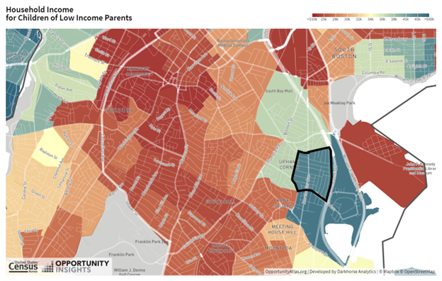
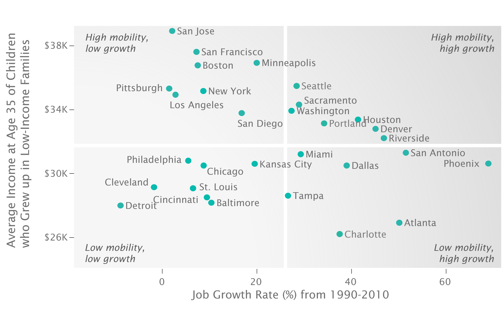

# The Causal Effect of Neighborhoods {#lec2_causaleffect}

## Introduction 

-	The national map from the Opportunity Atlas shows rates of upward mobility across America The statistic we are focusing on specifically is the average income in adulthood of kids who grow up in families at the 25th percentile of the parental income distribution. The red colors are areas with lower levels of upward mobility and blue colors are areas with higher levels of upward mobility.  

-	For instance, we can look at the household income in adulthood for children from low-income families in South Boston. 

```{r , fig.cap="Household Income for Children of Low Income Parents in South Boston", echo=FALSE, out.width = '90%'}

```

- In areas like Roxbury, you see outcomes that are on par with some of the lowest upward mobility places in the United States. 

- There is significant local variation across Census tracts in South Boston. This type of variation gives us a potential way to learn about what is driving the difference between the blue and the red areas. 

## Causal Effects of Neighborhoods vs. Sorting

- There are two different explanations for the variation in children's outcomes across areas. 
    - Sorting
    - Causal effects

- Sorting reflects the simple observation that different people live in different areas. Geographic patterns in upward mobility may reflect the sorting of people across places. 

- If sorting is the main explanation for the patterns we have seen, then the types of policies that we would use to address this issue of equality of opportunity would be people-focused.  

- The causal effects explanation reflects the idea that if we were to take a given child and put that child in the red-colored part of the map versus the blue-colored part of the map, we'd see different outcomes for that given child. Under that causal effect explanation, we might actually want to have policies that target the red-colored places on the map. 

## Identifying Causal Effects of Neighborhoods

-	An ideal experiment would be to assign children to neighborhoods at random. Social scientists approximate that sort of ideal experiment with a “quasi-experimental” design, where we come as close to an experiment as we can with the data that we have on-hand.   

-	To identify the causal effect of neighborhoods, Chetty and co-authors use a quasi-experimental approach to study three million families who move across Census tracts in observational data. In these data, there are many families who move with their kids across neighborhoods. We exploit variation in the age of the child when a family moves in order to isolate the causal effect of environment.  

- Under an “identification assumption” that makes this as good as an experiment, this research design allows us to estimate the causal effect of neighborhoods on children’s long run outcomes.  

- For example, imagine a hypothetical set of families that moved from Roxbury, where children from low-income families have an average adult income of \23,000 to Savin Hill, where children from low-income families have an average adult income over \$40,000, with kids of different ages, starting with families who moved when their child is exactly two years old. The first dot in the figure below plots what our estimates imply about the impact of this move for their earnings. 

```{r , fig.cap="Income Gain from Moving to a Better Neighborhood", echo=FALSE, out.width = '90%'}
knitr::include_graphics("images/child_move.png")
```

- We then repeat that analysis for kids who moved when they're three, four, five and so on. Those are the other dots in the figure.

- The figure shows a very clear declining pattern. The later you make that move from Roxbury to Savin Hill, the less of a gain you get.  

- There are three key lessons that you can see from this chart. 
    - Where you grow up really matters.  
    - Childhood environment seems to matter more than where you live as an adult. 
    - Every extra year of exposure to a better childhood environment improves kids' long-term outcomes.  

- We use the data on all three million families who move across all the different neighborhoods in America to see how the age at which a child moves to a place where we see average incomes of kids who grew up there from birth impacts how much of that gain they pick up.

- We use a linear regression to regress the child’s own income in adulthood on the average incomes of the kids we see in the destination versus the origin Census tract.  We run a separate regression for kids who move at each of these different ages.

## Stating and assessing the identification assumption for the movers research design

- Every quasi-experimental design relies on an identification assumption to make it as good as a randomized experiment. 

- In this case, the identification assumption is that the timing of a child’s move to a better or worse area is unrelated to other determinants of the child’s outcomes. Under that assumption, we can interpret the variation as a pure causal effect of moving at different ages. 

- There are two possible concerns in making this assumption.

- First, the families who move when their children are young may just be different from the families who move when their children are older. 

- To address this first concern, we compare siblings' outcomes within the same family, in order to control for family effects. We get the same results comparing across siblings within a family, which demonstrates that the results cannot be driven by differences between families who are moving when their kids are young and families who are moving when their kids are old.

- The second concern with our identification assumption has to do with time-varying factors that are related to where a family moves. 

- To address this second concern, we use differences in neighborhood effects across subgroups to implement what we call “placebo tests.” In the Opportunity Atlas data, there is variation across neighborhoods and subgroups, such as gender, racial group, and so forth that allows us to run this analysis.  

- For example, imagine you have a family that has a son and a daughter.  We measure what happens to those kids' outcomes when they move to a place where boys have particularly good outcomes.  We find that their son's outcomes improve in proportion to the number of years they're growing up there, but their daughter's outcomes don't change at all. 

- We find that kid's outcomes converge to the full distribution of outcomes that you see in the destination to which they're moving in a very precise way, which rules out this type of bias. 

## Why Does Upward Mobility Differ Across Areas?

- What is driving these differences in mobility across places? Why do some places produce much better outcomes for disadvantaged kids than others? 

```{r , fig.cap="Income Gain from Moving to a Better Neighborhood", echo=FALSE, out.width = '90%'}

```

- There's not much of a relationship between upward mobility and rates of job growth.  

- Some cities with high job growth and low upward mobility are importing talent from other parts of America, so the kids who grew up there aren’t benefiting.

- High mobility is not fundamentally about indicators of the labor market strength, as measured by variables like job growth as well as wage growth, types of jobs, or types of industry. 

## The Five Strongest Correlates of Upward Mobility

- The five strongest correlates of upward mobility that we have found are:

1. Segregation 

    - Places that are more segregated, by race or by income, tend to have significantly lower levels of upward mobility. In very segregated places, like Atlanta, low-income people of all races have poor chances of climbing the income ladder. 
    - One explanation is that segregation matters because it creates differences in resources, particularly schools. 
    - A different explanation is that the mechanism is spillovers in mentoring and knowledge. 

2. Income Inequality

    - Places with a smaller middle class tend to have much less mobility across generations. As we have more inequality within a generation, it might also become harder for kids to climb up across generations. 

3. School Quality
    - Places with better schools have higher rates of upward mobility. 

4. Family Structure

    - Areas with more single parents have significantly lower rates of upward mobility. This is the strongest predictor in the data. 
    - Upward mobility is lower in a community with a lot of single parents, even for children who are growing up in two-parent households. It is not about whether your own parents are married or not, but rather the rate of single-parent households in the broader community. 

5. Social Capital

    - Social capital is a bit of a nebulous and complicated concept. 
    - “It takes a village to raise a child.” Will someone else help you out even if you're not doing well? 

- These correlational analyses must be interpreted cautiously. It just gives you clues about what might be going on. 

## Policy Interest in Increasing Upward Mobility

- As a result of putting out these studies in the past four or five years, we have seen a real shift in the national conversation to focus on income mobility and the role of childhood environment, much of it coming through the media. 

- A lot of local areas started to focus on these issues in a very systematic way. One example is Charlotte, N.C. 

- Charlotte is a unique city in that it ranks lowest—50th out of 50—in terms of rates of upward mobility for kids born into low-income families despite being a very successful economy by all traditional measures.  

- Charlotte formed a task force and a commission to focus with all its government agencies, local philanthropies, and so forth to make increasing upward mobility for kids growing up in Charlotte a central priority for the city. 

- Our research group at Harvard has now started to team up with the Charlotte local government and local actors to try to address this problem. 

- The release of the Opportunity Atlas data was really critical for doing this, because those data change the scale of the problem.  It allows us to examine data at the level of Census tract, which collapses the scale of the problem. 

## Policies to Improve Upward Mobility

- There are two different conceptual approaches that try to improve outcomes. 
 
```{r , fig.cap="Two Approaches to Increasing Moibility", echo=FALSE, out.width = '90%'}
knitr::include_graphics("images/improve_mob.png")
```

- The first is a Moving to Opportunity approach. The simplest thing that you can do to help low-income kids do better is to provide them better access to those neighborhoods. 

- A different approach is Place-Based Investments. The idea is to take the places that are in the red colors of the map and turn them blue. 

- There's no way we’ll ever be able to achieve full scale purely through the Moving to Opportunity approach.  Ultimately, the long run path is to improve low-opportunity places. 

## Affordable Housing Policies in the United States

- In the U.S., we spend a tremendous amount of money in the US on affordable housing policies to help low-income families move to better neighborhoods.   

- These policies include subsidized housing vouchers to rent better apartments. 

- There are also many efforts to create mixed-income affordable housing development, like the low-income housing tax credit. 
- Are these types of housing policies effective in increasing social mobility? Does this Moving to Opportunity sort of approach work? How can we make it better? 

- A very useful benchmark to start from is to think about the simplest alternative to address any problem, which is to just give people cash. Which policy will have a greater impact on kids' rates of upward mobility, giving you \$1,000 in cash or a \$1,000 voucher to move to a higher opportunity neighborhood? 

- The conventional economics answer from a traditional economic point of view is that cash grants of an equivalent dollar amount are strictly better than giving someone a voucher specifically focused on housing. 
- Vouchers work out to be more effective than giving people cash, which violates the standard economic model. 

## A Framework for Studying the Effects of Housing Vouchers

- What is the impact of giving a family a housing voucher, the \$10,000 of assistance to rent an apartment or a house, on kids' rates of upward mobility that is kids' earnings in adulthood? 

- Imagine that you have 10,000 different children and we will number them $i=1,…,10000$.  Let us call child $i$'s earnings $Y_i$.  We are going to define $Y_i (V=1)$ as child i’s earnings if the family gets a housing voucher and $Y_i (V=0)$  as the child’s earnings if the family does not get a voucher. 

- $Y_i (V=1)$ and  $Y_i (V=0)$ are just two different hypothetical numbers. If your family had gotten a voucher, your earnings are $Y_i (V=1)$, which might be \$20,000 a year in the average case.  If your family didn't get a voucher, your earnings are $Y_i (V=0)$, which might another number like \$15,000 a year. 

- The objective of the empirical analysis is to estimate the difference $Y_i (V=1)-Y_i (V=0)$. That difference is the causal effect of getting the voucher on kids' earnings. Let's call that $G_i$. My goal is to estimate that $G_i=Y_i (V=1)-Y_i (V=0)$. 

- The fundamental problem in empirical science is that you don't observe $Y_i (V=1)$ and $Y_i (V=0)$ for the same person. The gold standard solution that people have come up with in order to solve that problem is to run a randomized experiment.

## Randomized Experiments

- Suppose you take those 10,000 kids and you flip a coin to determine if each of them gets a voucher or not.  Then you compute the average level of earnings for the 5,000 who randomly got a voucher and the 5,000 who randomly did not get a voucher. The difference between those two averages gives you an estimate of $G_i$, the average treatment effect of getting a voucher. 

- The randomized experiment works because it ensures that the two groups are identical, except for the fact that one of them got the vouchers and one of them didn't. Everything else is going to be similar about them, which allows you to isolate just the causal effect of getting the voucher itself.

- Suppose you just compared the average earnings of people who applied versus people who didn't. The core problem is that there is no guarantee that any difference in earnings that you see between those two groups is driven by getting the voucher itself.  

## Non-Compliance in Randomized Experiments
	
- A common practical problem that we face in randomized experiments when we try to do this in the field is called **noncompliance**, when subjects don’t comply with the treatment protocol. 

- For instance, in the voucher case there's no guarantee that all families given a voucher are going to use it to rent a new apartment.  

- You can adjust the estimated impact for the rate of compliance by dividing the **Estimated Impact** by the **Compliance Rate**:

$$\text{True Effect}=\frac{\text{Estimated Impact}}{\text{Compliance Rate}}$$

In the previous example, we would do

$$\text{True Effect}=\frac{\text{Estimated Impact}}{\text{Compliance Rate}}=\frac{1000}{0.5}=2000$$

- An important issue is that this estimate is the implied effect for the compliers—the families who would comply with the experimental protocol. A separate question is what would the effect have been for the people who chose not to comply? The local average treatment effect (**LATE**) applies to a certain set of **compliers**, but It may not apply to noncompliers. From a policy perspective, we typically care about the treatment effect for the compliers typically.
