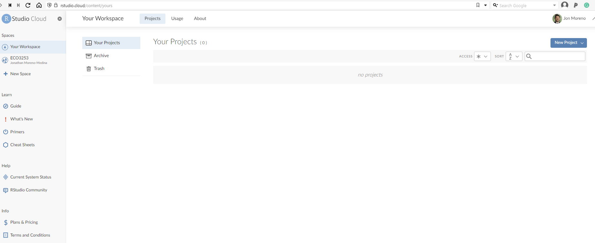
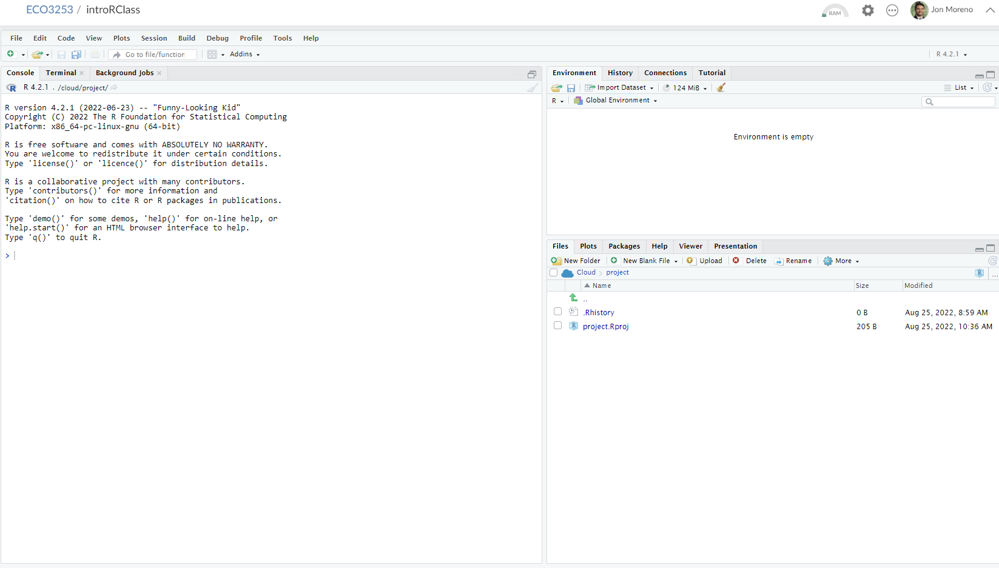

# (PART) Tools {-}

# Very Brief Intro to Data in R {#getting-started}

## Why R again?

### Why are we learning R? I wanted to learn about economics of public and social issues...

```{r setup_getting_started, include=FALSE, purl=FALSE}
library(pacman)
p_load(
  broom, tidyverse,
  ggplot2, ggthemes, ggforce, viridis, extrafont, gridExtra,
  dplyr, here, magrittr, knitr
)
chap <- 2
lc <- 0
rq <- 0
# **`r paste0("(LC", chap, ".", (lc <- lc + 1), ")")`**
# **`r paste0("(RQ", chap, ".", (rq <- rq + 1), ")")`**

knitr::opts_chunk$set(
  tidy = FALSE, 
  out.width = '\\textwidth', 
  fig.height = 4,
  fig.align='center',
  warning = FALSE
  )

options(scipen = 99, digits = 3)

# Set random number generator see value for replicable pseudorandomness. Why 76?
# https://www.youtube.com/watch?v=xjJ7FheCkCU
set.seed(76)
#alternative way of loading data:
#githubURL <- ("https://raw.githubusercontent.com/jrm87/ECO3253_fall2023/master/rds/trials.rds")
#download.file(githubURL,"trials.rds", method="curl")
#data <- readRDS("trials.rds")

include_image <- function(path,                           
                          html_opts = "width=45%", 
                          latex_opts = html_opts,
                          alt_text = ""){
  if(knitr:::is_html_output()){
    glue::glue("{{ {html_opts} }}")
  } else if(knitr:::is_latex_output()){
    glue::glue("{{ {latex_opts} }}")    
  }
}
```

This class *is* about social issues in economics. But what are those social issues? 

* Economic mobility and inequality
* Effects of education on wages and inequality
* Criminal justice system outcomes
* Pollution and climate change
* and so on...

How can we know if going to school increases wages? Or if economic mobility is low or high? 

We need to *analyze* data! We can do that analysis by hand... but that would be very time consuming. Or we can use a super calculator with amazing capabilities to explore data, maps, etc: enter **R** and **R Studio**.

This course is not about teaching you all about **R**! We will only cover the very basics so you can jump into doing some empirical analysis by yourself. You will be able to expand much more on the tools briefly described here in other, more advanced, courses in the Economics sequence. 

:::: {.blackbox data-latex=""}
::: {.center data-latex=""}
**Important!**
:::

For the vast majority of exercises in our course, _I will give you all the code you will have to run_. So, it's not like you need to write anything from scratch! 
::::

I do want you to get a basic understanding of what we will be doing when we run those lines.

### Ok, but why R?

- **R** is free and open source!
- **R** has a vibrant online community!
- **R** is very flexible and powerful — adaptable to nearly any task ( _e.g._, correlations, econometrics, spatial data analysis, machine learning, web scraping, data cleaning, website building, teaching.)
- Employers like **R** over alternatives

### Added benefits of learning R

Employers hire people that knows **R**. Again, we will only cover the essentials, but maybe you want to keep this in mind as you go along with your studies. 

```{r, statistical_languages, echo = F, out.width = '80%'}
# The popularity data
pop_df <- data.frame(
  lang = c("SQL", "Python", "R", "SAS", "Matlab", "SPSS", "Stata"),
  n_jobs = c(107130, 66976, 48772, 25644, 11464, 3717, 1624),
  free = c(T, T, T, F, F, F, F)
)
pop_df %<>% mutate(lang = lang %>% factor(ordered = T))
# Plot it
red_pink <- "#e64173"
ggplot(data = pop_df, aes(x = lang, y = n_jobs, fill = free)) +
geom_col() +
geom_hline(yintercept = 0) +
aes(x = reorder(lang, -n_jobs), fill = reorder(free, -free)) +
xlab("Statistical language") +
scale_y_continuous(label = scales::comma) +
ylab("Number of jobs") +
ggtitle(
  "Comparing statistical languages",
  subtitle = "Number of job postings on Indeed.com, 2019/01/06"
) +
scale_fill_manual(
  "Free?",
  labels = c("True", "False"),
  values = c(red_pink, "darkslategray")
) +
theme_pander(base_size = 17) +
theme(legend.position = "bottom")
```

## Key concepts before we start: 

Before we can start exploring data in R, there are some key concepts to understand first:

1. What are R, Posit Cloud and RStudio?
1. How do I code in R?
1. What are R packages?

We'll introduce these concepts in upcoming Sections \@ref(r-rstudio)-\@ref(packages). Then we'll introduce our first data set: data on the economic mobility for all neighborhoods across the US in the `atlas` dataset.

### What are R and RStudio? {#r-rstudio}

For much of this book, we will assume that you are using R via RStudio. First time users often confuse the two. At its simplest:

* R is like a car's engine.
* RStudio is like a car's dashboard.

R: Engine            |  RStudio: Dashboard 
:-------------------------:|:-------------------------:
{ height=1.7in }  |  { height=1.7in }

More precisely, R is a programming language that runs computations while RStudio is an *integrated development environment (IDE)* that provides an interface by adding many convenient features and tools. So just as having access to a speedometer, rearview mirrors, and a navigation system makes driving much easier, using RStudio's interface makes using R much easier as well. 


### R and RStudio: In your computer or in the cloud? The benefit of Posit Cloud

To use R and RStudio, you can:

- install it in your computer (see the book) or ...
- run it on someone else's computer (the cloud!). We will do that, so you don't have to worry about installations. 

In this course I won't require you to install R and RStudio in your own computer. Instead, we will use the cloud! In particular, the website that we will use to manage RStudio is called Posit Cloud. 

You should have received an invitation for the course in your email. If you would still like to install R and RStudio in your own computer, please follow the instructions in Section 1.1.1 in this [link](https://nulib.github.io/moderndive_book/1-getting-started.html). Of course, you are encouraged to experiment in your own machine as well. Notice, however, that you should carry out the assignments and projects in Posit Cloud. 

:::: {.blackbox data-latex=""}
::: {.center data-latex=""}
**Important!**
:::

Homework and projects should be carried in Posit Cloud (not your personal computer). 
::::


## Let's open R!

### RStudio in Posit cloud

Let's jump in! You should have received a link for you to access RStudio in the cloud through Posit Cloud. There is a monthly fee to use this service of \$5. We will be using the service for the next 4 months, so you should be paying a total of \$20 across these 4 months. Recall also that there is no required textbook for this class. Once the Fall semester finishes, it is your responsibility to cancel your subscription. 

Once more: remember that all the **code is running on someone's computer**. In this case, it is running on a computer owned by the folks at RStudio. 

1. Receive link with invitation

You should have received an email with a link inviting you to join Posit Cloud. Once you click on the link, you should land in a page like this: 

```{r, echo=FALSE, out.width = '80%'}
knitr::include_graphics("images/rstudio_cloud1.png")
```

Then you should fill out the information for your account. Please use your utsa email account (the account you should have received the invitation to). Once you click on **Sign Up**, it will show this: 

```{r, echo=FALSE, out.width = '80%'}
knitr::include_graphics("images/rstudio_cloud2.png")
```

Then you need to go back to your email and verify it. Then log back in again!

2. Inside Posit Cloud select **ECO3523-Fall23**

Once you have logged back in, you should land in the main page, which should look like this:

```{r, echo=FALSE, out.width = '80%'}

```

Click on the left where it says  **ECO3523-Fall23**. That is where you will see all the material and projects for this class. 

```{r, echo=FALSE, out.width = '80%'}
knitr::include_graphics("images/rstudio_cloud4.png")
```

3. Select the appropriate project you want to work on

Once you are in the **ECO3523-Fall23** tab, you should see a list of individual projects we will work on throughout the semester. It should look something like this:

```{r, echo=FALSE, out.width = '80%'}
knitr::include_graphics("images/rstudio_cloud5.png")
```

For our first class on R you will select the link that says **introRClass**. That is it! Now we are ready to get to work!

### Using R via RStudio in Posit Cloud

Recall our car analogy from above. Much as we don't drive a car by interacting directly with the engine but rather by interacting with elements on the car's dashboard, we won't be using R directly but rather we will use RStudio's interface.

After you open Posit Cloud and follow the previous instructions, you should see a panel like the following:

```{r, echo=FALSE, out.width = '80%'}

```

Note the three panes, which are three panels dividing the screen: The *Console pane*, the *Files pane*, and the *Environment pane*. Over the course of this chapter, you'll come to learn what purpose each of these panes serve. 

## How do I code in R? {#code}

Now that you're set up with Posit Cloud, you are probably asking yourself "OK. Now how do I use R?" The first thing to note as that unlike other statistical software programs like Excel, STATA, or SAS that provide [point and click](https://en.wikipedia.org/wiki/Point_and_click) interfaces, R is an [interpreted language](https://en.wikipedia.org/wiki/Interpreted_language), meaning you have to enter in R commands written in R code. In other words, you have to code/program in R. Note that we'll use the terms "coding" and "programming" interchangeably in this book.

While it is not required to be a seasoned coder/computer programmer to use R, there is still a set of basic programming concepts that R users need to understand. Consequently, while this course is not a book on programming, you will still learn just enough of these basic programming concepts needed to explore and analyze data effectively.


### Basic programming concepts and terminology {#programming-concepts}

We now introduce some basic programming concepts and terminology. Instead of asking you to learn all these concepts and terminology right now, we'll guide you so that you'll "learn by doing." Note that in this book we will always use a different font to distinguish regular text from `computer_code`. The best way to master these topics is, in our opinions, "learning by doing" and lots of repetition.

* Basics:
    + *Console*: Where you enter in commands. \index{console}
    + *Running code*: The act of telling R to perform an action by giving it commands in the console.
    + *Objects*: Where values are saved in R. In order to do useful and interesting things in R, we will want to *assign* a name to an object. For example we could do the following assignments: `x <- 44 - 20` and `three <- 3`. This would allow us to run `x + three` which would return `27`.
    + *Data types*: Integers, doubles/numerics, logicals, and characters. 
* *Vectors*: A series of values. These are created using the `c()` function, where `c()` stands for "combine" or "concatenate." For example: `c(6, 11, 13, 31, 90, 92)`.
* *Factors*: *Categorical data* are represented in R as factors.
* *Data frames*: Data frames are like rectangular spreadsheets: they are representations of datasets in R where the rows correspond to *observations* and the columns correspond to *variables* that describe the observations. \index{data frames} We'll cover data frames later in Section \@ref(mobilitydata).
* *Conditionals*: 
    + Testing for equality in R using `==` (and not `=` which is typically used for assignment). Ex: `2 + 1 == 3` compares `2 + 1` to `3` and is correct R code, while `2 + 1 = 3` will return an error.
    + Boolean algebra: `TRUE/FALSE` statements and mathematical operators such as `<` (less than), `<=` (less than or equal), and `!=` (not equal to). 
    + Logical operators: `&` representing "and" as well as `|` representing "or." Ex: `(2 + 1 == 3) & (2 + 1 == 4)` returns `FALSE` since both clauses are not `TRUE` (only the first clause is `TRUE`). On the other hand, `(2 + 1 == 3) | (2 + 1 == 4)` returns `TRUE` since at least one of the two clauses is `TRUE`. 
* *Functions*, also called *commands*: Functions perform tasks in R. They take in inputs called *arguments* and return outputs. You can either manually specify a function's arguments or use the function's *default values*. 

This list is by no means an exhaustive list of all the programming concepts and terminology needed to become a savvy R user; such a list would be so large it wouldn't be very useful, especially for novices. Rather, we feel this is a minimally viable list of programming concepts and terminology you need to know before getting started. I'm confident you can learn the rest as you go. Remember that your mastery of all of these concepts and terminology will build as you practice more and more.^[If you truly insist on getting more information, you can check this link explaining some of the basics: https://rstudio-education.github.io/hopr/basics.html ;but again, **this is not required or expected**.]

## In Class Exercise

Try running the following commands in the console. What do you see for each one? 
```{r, echo=TRUE, eval=FALSE}
2*3
2*pi
log(10)
exp(2)
sqrt(25)
3==3
3==4
3<=4
3!=4
x <- c(1,3,2,5)# this is called a 'vector'
x #what do you see?
x <- c(1,6,2)
x #now what do you see?
y <- c(1,4,3) # USE ARROW!
length(x)
length(y)
x+y
#write this
write this again
```

### Errors, warnings, and messages

Noticed the last thing that appeared in the console when you wrote `write this again`? It had scary red letters. It is an example of something that intimidates new R and RStudio users: how it reports *errors*, *warnings*, and *messages*. R reports errors, warnings, and messages in a glaring red font, which makes it seem like it is scolding you. However, seeing red text in the console is not always bad.

R will show red text in the console pane in three different situations:

* **Errors**: When the red text is a legitimate error, it will be prefaced with "Error in…" and try to explain what went wrong. Generally when there's an error, the code will not run. For example, we'll see in Subsection \@ref(package-use) if you see `Error in ggplot(...) : could not find function "ggplot"`, it means that the `ggplot()` function is not accessible because the package that contains the function (`ggplot2`) was not loaded with `library(ggplot2)`. Thus you cannot use the `ggplot()` function without the `ggplot2` package being loaded first.
* **Warnings**: When the red text is a warning, it will be prefaced with "Warning:" and R will try to explain why there's a warning. Generally your code will still work, but with some caveats. For example, you will see in Chapter \@ref(viz) if you create a scatterplot based on a dataset where one of the values is missing, you will see this warning: `Warning: Removed 1 rows containing missing values (geom_point)`. R will still produce the scatterplot with all the remaining values, but it is warning you that one of the points isn't there.
* **Messages**: When the red text doesn't start with either "Error" or "Warning", it's *just a friendly message*. You'll see these messages when you load *R packages* in the upcoming Subsection \@ref(package-loading) or when you read data saved in spreadsheet files with the `read_csv()` function as you'll see in Chapter \@ref(tidy). These are helpful diagnostic messages and they don't stop your code from working. Additionally, you'll see these messages when you install packages too using `install.packages()`.

:::: {.blackbox data-latex=""}
::: {.center data-latex=""}
**Important!**
:::

When you see red text in the console, *don't panic*! Just check out what it could be.
::::

Remember, when you see red text in the console, *don't panic*. It doesn't necessarily mean anything is wrong. Rather:

* If the text starts with "Error", figure out what's causing it. <span style="color:red">Think of errors as a red traffic light: something is wrong!</span>
* If the text starts with "Warning", figure out if it's something to worry about. For instance, if you get a warning about missing values in a scatterplot and you know there are missing values, you're fine. If that's surprising, look at your data and see what's missing. <span style="color:gold">Think of warnings as a yellow traffic light: everything is working fine, but watch out/pay attention.</span>
* Otherwise the text is just a message. Read it, wave back at R, and thank it for talking to you. <span style="color:green">Think of messages as a green traffic light: everything is working fine.</span>

### Tips on learning to code

Learning to code/program is very much like learning a foreign language, it can be very daunting and frustrating at first. Such frustrations are very common and it is very normal to feel discouraged as you learn. However just as with learning a foreign language, if you put in the effort and are not afraid to make mistakes, anybody can learn. 

Here are a few useful tips to keep in mind as you learn to program:

* **Remember that computers are not actually that smart**: You may think your computer or smartphone are "smart," but really people spent a lot of time and energy designing them to appear "smart." Rather you have to tell a computer everything it needs to do. Furthermore the instructions you give your computer can't have any mistakes in them, nor can they be ambiguous in any way.
* **Take the "copy, paste, and tweak" approach**: Especially when learning your first programming language, it is often much easier to taking existing code that you know works and modify it to suit your ends, rather than trying to write new code from scratch. We call this the *copy, paste, and tweak* approach. So early on, we suggest not trying to write code from memory, but rather take existing examples we have provided you, then copy, paste, and tweak them to suit your goals. Don't be afraid to play around!
* **The best way to learn to code is by doing**: Rather than learning to code for its own sake, we feel that learning to code goes much smoother when you have a goal in mind or when you are working on a particular project, like analyzing data that you are interested in. 
* **Practice is key**:  Just as the only method to improving your foreign language skills is through practice, practice, and practice; so also the only method to improving your coding is through practice, practice, and practice. Don't worry however; we'll give you plenty of opportunities to do so!


## What are R packages? {#packages}

Another point of confusion with many new R users is the idea of an R package. R packages extend the functionality of R by providing additional functions, data, and documentation. They are written by a world-wide community of R users and can be downloaded for free from the internet. For example, among the many packages we will use in this book are the `ggplot2` package for data visualization which we will cover later (or you can check [here](https://nulib.github.io/moderndive_book/2-viz.html)) or the `dplyr` package for data wrangling (again, we will cover later, but check [this](https://nulib.github.io/moderndive_book/3-wrangling.html#needed-packages-1) if you want to know more).

A good analogy for R packages is they are like apps you can download onto a mobile phone:

R: A new phone           |  R Packages: Apps you can download
:-------------------------:|:-------------------------:
{ height=1.5in } |  { height=1.5in }

So R is like a new mobile phone: while it has a certain amount of features when you use it for the first time, it doesn't have everything. R packages are like the apps you can download onto your phone from Apple's App Store or Android's Google Play. 

Let's continue this analogy by considering the Instagram app for editing and sharing pictures. Say you have purchased a new phone and you would like to share a recent photo you have taken on Instagram. You need to:

1. *Install the app*: Since your phone is new and does not include the Instagram app, you need to download the app from either the App Store or Google Play. You do this once and you're set. You might do this again in the future any time there is an update to the app.
1. *Open the app*: After you've installed Instagram, you need to open the app.

Once Instagram is open on your phone, you can then proceed to share your photo with your friends and family. The process is very similar for using an R package. You need to:

1. *Install the package*: This is like installing an app on your phone. Most packages are not installed by default when you install R and RStudio. Thus if you want to use a package for the first time, you need to install it first. Once you've installed a package, you likely won't install it again unless you want to update it to a newer version.
1. *"Load" the package*: "Loading" a package is like opening an app on your phone. Packages are not "loaded" by default when you start RStudio on your computer; you need to "load" each package you want to use every time you start RStudio.

Let's now show you how to perform these two steps for the `ggplot2` package for data visualization.


### Package installation {#package-installation}

For the most part, in Posit Cloud, I will pre-install the packages you are going to need to use. But just in case you also want to work on your own machine, or install your own packages, here I explain that a bit more. There are two ways to install an R package. For example, to install the `ggplot2` package:

1. **Easy way**: In the Files pane of RStudio/Posit Cloud:
    a) Click on the "Packages" tab
    a) Click on "Install"
    a) Type the name of the package under "Packages (separate multiple with space or comma):" In this case, type `ggplot2`
    a) Click "Install"  
     { height=4in }
1. **Slightly harder way**: An alternative but slightly less convenient way to install a package is by typing `install.packages("ggplot2")` in the Console pane of RStudio and hitting enter. Note you must include the quotation marks.

Much like an app on your phone, you only have to install a package once. However, if you want to update an already installed package to a newer verions, you need to re-install it by repeating the above steps.

```{block lc2-0, type='learncheck'}
**_Learning check_**
```
**`r paste0("(LC", chap, ".", (lc <- lc + 1), ")")`** Repeat the above installing steps, but for the `dplyr`, and `knitr` packages. This will install the earlier mentioned `dplyr` package, and the `knitr` package for writing reports in R. 
```{block, type='learncheck'}
```
 

### Package loading {#package-loading}

Recall that after you've installed a package, you need to "load" it, in other words open it. We do this by using the `library()` command. For example, to load the `ggplot2` package, run the following code in the Console pane. What do we mean by "run the following code"? Either type or copy & paste the following code into the Console pane and then hit the enter key. 

```{r, eval=FALSE}
library(ggplot2)
```

If after running the above code, a blinking cursor returns next to the `>` "prompt" sign, it means you were successful and the `ggplot2` package is now loaded and ready to use. If however, you get a red "error message" that reads...

```
Error in library(ggplot2) : there is no package called ‘ggplot2’
```

... it means that you didn't successfully install it. In that case, go back to the previous subsection "Package installation" and install it. 

```{block lc2-1, type='learncheck'}
**_Learning check_**
```
**`r paste0("(LC", chap, ".", (lc <- lc + 1), ")")`** "Load" the `dplyr`, and `knitr` packages as well by repeating the above steps.
```{block, type='learncheck'}
```
 

### Package use {#package-use}

One extremely common mistake new R users make when wanting to use particular packages is that they forget to "load" them first by using the `library()` command we just saw. Remember: *you have to load each package you want to use every time you start RStudio.* If you don't first "load" a package, but attempt to use one of its features, you'll see an error message similar to:

```
Error: could not find function
```

R is telling you that you are trying to use a function in a package that has not yet been "loaded." Almost all new users forget do this when starting out, and it is a little annoying to get used to. However, you'll remember with pratice.  


## Hands-on exercise!

### Explore your first dataset: economic mobility in the US {#mobilitydata}

Let's put everything we've learned so far into practice and start exploring some real data! These "spreadsheet"-type datasets are called _data frames_ in R; we will focus on working with data saved as data frames throughout this course.

Step 1: Load all the packages needed for this exercise (assuming you've already installed them). 


```{r message=FALSE}
library(dplyr)
library(tibble)
atlas <- readRDS(gzcon(url("https://raw.githubusercontent.com/jrm87/ECO3253_fall2023/master/data/atlas.rds")))
atlas<-tibble(atlas)
```


### Economic mobility data

The [Opportunity Atlas](https://www.opportunityatlas.org/) is a freely available interactive mapping tool that traces the roots of outcomes such as poverty and incarceration back to the neighborhoods in which children grew up. The `atlas` dataset we loaded has the underlying data to describe equality of opportunity across the `r scales::comma(nrow(atlas))` different neighborhoods in the United States. 

Let's unpack these data a bit more!

### `atlas` data frame

We will begin by exploring the `atlas` data frame we just loaded to get an idea of its structure. Run the following code in your console (either by typing it or cutting & pasting it): it loads the `atlas` dataset into your Console. Note depending on the size of your monitor, the output may vary slightly. 

```{r load_atlas, echo=TRUE}
atlas
```

Let's unpack this output:

* `A tibble: 73,278 x 62`: A `tibble` is a kind of data frame used in R. This particular data frame has
    + `73,278` rows (one for each neighborhood)
    + `62` columns corresponding to 62 variables describing each observation (e.g. neighborhood in this case)
* `tract county state cz czname hhinc_mean2000 mean_commutetime2000 ...` are different columns, in other words variables, of this data frame.
* We then have the first 10 rows of observations corresponding to 10 neighborhoods.
* `... with 73,268 more rows, and 52 more variables:` indicating to us that 73,268 more rows of data and 52 more variables could not fit in this screen.

Unfortunately, this output does not allow us to explore the data very well. Let's look at different tools to explore data frames.

### Exploring data frames {#exploredataframes}

Among the many ways of getting a feel for the data contained in a data frame such as `atlas`, we present three functions that take as their "argument", in other words their input, the data frame in question. We also include a fourth method for exploring one particular column of a data frame:

1. Using the `View()` function built for use in RStudio. We will use this the most.
1. Using the `glimpse()` function, which is included in the `dplyr` package.
1. Using the `$` operator to view a single variable in a data frame.


**1. `View()`**:

Run `View(atlas)` in your Console in RStudio, either by typing it or cutting & pasting it into the Console pane, and explore this data frame in the resulting pop-up viewer. You should get into the habit of always `View`ing any data frames that come your way.  Note the capital "V" in `View`.  R is case-sensitive so you'll receive an error is you run `view(atlas)` instead of `View(atlas)`.

```{block lc2-2, type='learncheck'}
**_Learning check_**
```

**`r paste0("(LC", chap, ".", (lc <- lc + 1), ")")`** What does any *ONE* row in this `atlas` dataset refer to?

- A. Data on an neighborhood 
- B. Data on a state
- C. Data on an person
- D. Data on multiple neighborhood

```{block, type='learncheck'}
```

By running `View(atlas)`, we see the different *variables* listed in the columns and we see that there are different types of variables.  Some of the variables like `poor_share2010`, `hhinc_mean2000`, and `share_hisp2010` are what we will call *quantitative* variables. These variables are numerical in nature. Other variables, like `tract` are *categorical*: they are just names (even if they have numbers). For example `tract` represents a Tract FIPS Code, that is, a 6-digit code assigned by the census folks to each neighborhood in 2010.

Note that if you look in the leftmost column of the `View(atlas)` output, you will see a column of numbers.  These are the row numbers of the dataset.  If you glance across a row with the same number, say row 5, you can get an idea of what each row corresponds to.

**2. `glimpse()`**:

The second way to explore a data frame is using the `glimpse()` function included in the `dplyr` package. Thus, you can only use the `glimpse()` function after you've loaded the `dplyr` package. This function provides us with an alternative method for exploring a data frame:

```{r, echo=TRUE}
glimpse(atlas)
```

We see that `glimpse()` will give you the first few entries of each variable in a row after the variable.  In addition, the *data type* of the variable is given immediately after each variable's name inside `< >`.  Here, `int` and `dbl` refer to "integer" and "double", which are computer coding terminology for quantitative/numerical variables.  In contrast, `chr` refers to "character", which is computer terminology for text data. Text data, such as the `czname` (the name of the metro area), are categorical variables. 

**3. `$` operator**

Lastly, the `$` operator allows us to explore a single variable within a data frame. For example, run the following in your console

```{r, echo=TRUE, eval=FALSE}
atlas$tract
```

We used the `$` operator to extract only the `tract` variable and return it as a vector of length 73,278. We will only be occasionally exploring data frames using this operator, instead favoring the `View()` and `glimpse()` functions.

## Conclusion

We've given you what we feel are the most essential concepts to know before you can start exploring data in R. There is much more to explore in R but this is a great place to get started!


### Additional resources

If you want to dive more and feel you could benefit from a more detailed introduction, check this short book: [Getting used to R, RStudio, and R Markdown](https://rbasics.netlify.com/) short book. 

It has screencast recordings that you can follow along and pause as you learn. Furthermore, there is an introduction to R Markdown, a tool used for reproducible research in R. We will see more about that in the next class. 

<center>
{ height=2.5in }
</center>
</center>
