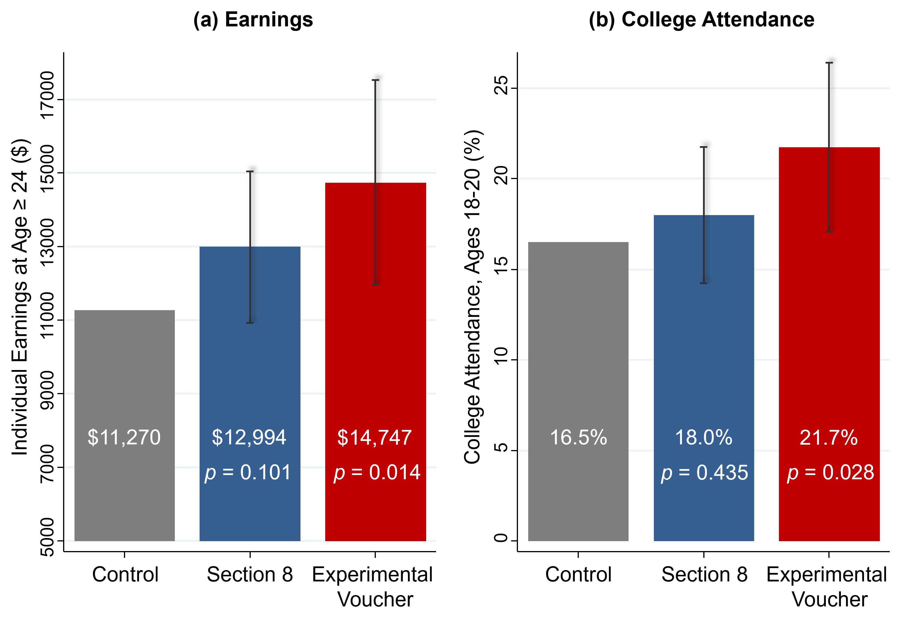

# Policies to Increase Upward Mobility {#lec3_mto-placebased}

## The Moving to Opportunity Experiment

- The Moving to Opportunity experiment was implemented in the Clinton administration, by the Housing and Urban Development agency, from 1994 to 1998 in five major cities in the United States: Baltimore, Boston, Chicago, L.A., and New York. The Housing and Urban Development agency randomly assigned 4,600 families to three different groups. The experimental group was offered a housing voucher that required them to move to a low-poverty census tract (less than 10% poverty rate). The Section 8 voucher group was offered the same value of housing voucher but with no restrictions. The control group was not offered a voucher. 

- There was non-compliance and 48% of families assigned to the experimental voucher group actually used the voucher to move to a new place in a low-poverty census tract, and 66% of the Section 8 group used the voucher to lease a new place.

- Several papers have been written on the Moving to Opportunity experiment. Early research found little effects of moving on earnings and employment rates for adults and older children. Motivated by the experiment on moving between neighborhoods, this experiment was reassessed to look for exposure effects among children.

```{r , echo=FALSE, out.width = '90%'}

```


## Reevaluating the Moving to Opportunities Experiment with a Big Data Approach

- The hypothesis was that earlier studies didn't find an effect because they didn't look at kids who were young enough. Childhood exposure effects look at impacts proportional to how long a child was exposed to a better environment. The new question was does the MTO experiment, the Moving to Opportunity approach, improve outcomes for children who moved particularly when they were very young? 

- To revaluate this experiment, the data from HUD was linked to tax records to follow young children over a long period of time. 

- The way these bars are constructed is that the grey bar always represents the mean for the control group. The blue bar then adds the effect of being in the Section 8 group to the mean for the control group to display the mean for the Section 8 group. The red bar does the same but for the experimental group. These calculations are made adjusting for non-compliance. 

- There’s a very clear difference in the earnings in adulthood for the kids who were assigned to the experimental group relative to Section 8 group relative to the control group. The values below the means are the p-values, which is a way of stating the likelihood that these differences occur due to random variation in the data as opposed to a real casual effect.  

- To interpret these results it’s possible to think of them in two different ways. First, what is the percentage change between the control and the other groups? The difference in earnings between the control group and the experimental group is about a 30% increase, which is large. However, in a real world sense earning about $15,000 a year is still not a large income. One way to tell this story is that there is a large effect but another way to look at it is that this approach isn’t going to help people reach the middle class; it only seems to bring people out of extreme poverty. 

- Below are the results of this analysis for several other outcomes. All graphs are constructed in the way explained above. Neighborhood quality measures the poverty rate in the neighborhood these children live in as adults. 

```{r , echo=FALSE, out.width = '90%'}
knitr::include_graphics("images/lec3_mto_placebased/lec3_mto_below13-2.png")
```

- On a wide variety of dimensions, it really seems like the Moving to Opportunity intervention actually does work in quite a significant way in improving outcomes for kids who were young. However if this approach is applied to older children (over the age of 13 at the time of the experiment) or adults, then all of these impacts disappear. That is consistent with the previous literature that found little to no effect of this experiment on adults and older children.

## The Three Limits of Randomized Controlled Trials

- There are three limits to randomized controlled trials. 

- First is attrition. When long-term experiments are conducted, it’s very hard to follow people over long periods of time. However, big data can help address this problem by systematically tracking people via things such as tax records. 

- Second is sample sizes. It’s difficult and expensive to run large experiments however lots of data is needed to have precise statistically analysis. Big data actually cannot solve this problem because while the cost of data has fallen, the cost of running an experiment has not. 

- Third is generalizability. Experiments are always conducted in specific settings and that means that those results don’t always apply to other settings. There’s actually no way to know before hand if the results of an experiment will generalize to some other location with different conditions.  

## How Quasi-Experimental Methods can Address Randomized Controlled Trial Limitations 

- Quasi-experimental methods using big data can address some of the limitations of randomized controlled trials. The way to think about quasi-experiments is that what they are doing is approximating experimental conditions by comparing groups that are similar. It's like the same idea, at a conceptual level, as the experiment. Rather than achieving comparability by randomizing, a quasi-experiment makes a reasonable identification assumption. 

- Quasi-experiments can be much larger which allows them to reach greater levels of statistically precision than randomized controlled trials. With larger samples, one can also run the analysis separately subgroups, such as by race, to that the findings are very generalizable. 

- The limitation of the quasi-experimental method is that it relies on a stronger assumption. One must believe that the two groups in the quasi-experiment are comparable to each other whereas in a randomized controlled trial all you have to believe is that randomization occurred. 

## Implications for Housing Voucher Policies

- The first implication of this evidence is that vouchers should be targeted at families with young children. What the US tends to do currently is put families on wait lists, when they have a kid, to get a housing voucher. Often, those wait lists can be incredibly long; sometimes they can be as long as 10 years. What’s going to happen there is that families get on the wait list when their kids are relatively young. They finally get to move when their kids are older, exactly when it has less benefit. Thus the current US system seems to have this large inefficiency of not targeting the right group.

- Second, it's very important to explicitly design these policies to help families move to affordable, high-opportunity areas. The families who had to find a low-poverty census tract to live in to use their voucher are the ones that saw the biggest improvements for their kids. This is especially important because it turns out that something like 80% of the 2.1 million vouchers that are issued by the US government each year are currently used in very high-poverty, low-opportunity neighborhoods. This is possibly happening because moving to opportunity is too expensive. To examine that point look at the following chart. 

- This it the price of buying opportunity for children in Seattle. Each dot here represents a different census tract or a different neighborhood in Seattle and the vertical axis is the measures of upward mobility. The horizontal axis is median two-bedroom rent in that neighborhood in 2015. There is a strong upward-sloping relationship, which shows that more expensive areas tend to be better for kids. However at each median rent there is a lot of variety in outcomes. Take a place like the Central District (shown above), which is where a lot of families with housing vouchers in Seattle currently live. It has poor outcomes. However, Normandy Park is actually less expensive than the Central District but produces dramatically better outcomes for children. This is the idea of an “opportunity bargain” which is currently being used in a pilot study.


```{r , echo=FALSE, out.width = '90%'}
knitr::include_graphics("images/lec3_mto_placebased/lec3_mob_seattle_rent3.png")
```


## The Stability of Historical Measures of Opportunity

- On concern is that this data is outdated. To prove that the historical estimates useful predictors of opportunity for children who are growing up in these neighborhoods now this study also examined the accuracy of the predictive power of the data. The methodology was to predict outcomes for kids in 1990 using data that is only one year old, then to predict outcomes for kids in 1990 using data that is two years old. The process was repeated for a total of 10 years. Using data that was 10 years old had a 90% accuracy rate, which is not perfect but still highly informative. 

## The Creating Moves to Opportunity Pilot in Seattle
 
- A current pilot project is being run in Seattle using all of the previous findings. The pilot provides information to tenants on which neighborhoods might provide better opportunities for their children. It also recruits landlords to accepting tenants with housing vouchers by simplifying the process of dealing with the housing authority. Finally, it offers housing search assistance.

## Three Concerns about the CMTO Approach

- There are three important potential concerns with the Moving to Opportunity approach. 

- First there is a large cost to the housing voucher program. However, one also has to consider the improved outcomes of children in the future and what that will contribute to future taxes. These children can also have lower incarceration rates and they might depend less on the welfare system so there are lower social costs as well from implementing this policy. Analysis from the Moving to Opportunities experiment showed that the incremental cost of providing vouchers relative to having a family in traditional public housing is actually negative. That is, taxpayers in the long run will actually save money from this program because they'll end up benefiting more down the road than it cost them to pay for the program in the beginning. 

- The second concern is negative spillovers. Some might be concerned that the integration of lower income families into neighborhoods hurts the higher income families living there already. This, I think, is the most important concern from a political point of view. That can be evaluated by looking at how the outcomes of the rich vary across areas in relation to the outcomes of the poor. Empirically, more integrated cities do not have worse outcomes for the rich, on average. 

- The third concern is a simple limit to scalability. It is impossible to move everyone from one neighborhood to another and expect to have significant effects. Ultimately, this means that a policy-based approach will need to use strategies to improve low-mobility neighborhoods as well as use the moving to opportunity approach. 

## The Idea Behind Place Based Investment

- The goal with place-based investment is to figure out what makes high mobility areas into what they are and change the low mobility areas to resemble the high mobility areas. The first step to do this is to look at key predictors of differences in mobility across places. There are four strong predictors. 

- The strongest predictor these differences are differences in poverty rates. Places that have less concentrated poverty tend to have better outcomes for low-income kids. Another way to say this is that the more mixed-income areas have better outcomes for low-income kids. 

- The second predictor is more stable family structures. That means these places have a larger share of two-parent families. 

- The third predictor is more social capital. Social capital can be defined as connections between low and high-income people. This is the kind place where somebody else might help you out even if you're not doing well. One example was Salt Lake City with the Mormon Church. 

- The fourth predictor, as you might expect intuitively, is better school quality. 

- The limitation of this type of correlational analysis is that it gives you a sense of what factors might be associated with these differences in outcomes across places, but it doesn’t indicated which of these things have a causal effect. Current research is attempting to figure what actually is having a casual effect in these neighborhoods. 

- Researchers have found that these correlations hold at an incredibly granular level. Once the poverty rate in one specific neighborhood is accounted for, the poverty rate of the next closest neighborhood has practically no predictive power on children’s mobility. This is important because it indicates that environment matters in a very local way. Rerunning this correlation using city blocks rather than census tracts yields that only the poverty rates in the blocks within a .6 mile radius of the block of interest matter in predicting children’s outcomes. This evidence should motivate policy makers to look at addressing mobility not on a national scale but on a local scale. 

## Place Based Intervention Policies

- There are lots of efforts by local governments, by non-profits, lots of people who care about these issues in the United States and elsewhere to try to revitalize neighborhoods. The problem there is very little systematic evidence to date on which of these programs actually work and which of them don't work. The reason this data doesn’t exist at the moment is that just because neighborhoods get new houses or better schools doesn’t mean that the people living there originally are better off, it could be that better off people moved into the area once the neighborhood was improved. Currently social scientists are working on ways to track these people, who lived in neighborhoods before interventions, across time.  

- Other work at the moment is focusing on building a pipeline for economic opportunity, starting from interventions at very early ages which could be things related to family stability or prenatal care, things like that, to early childhood education. This process would continue throughout childhood with different programs as children age. Throughout this whole process, affordable housing is key since as neighborhoods are improved then more people want to move into the area, which drives up prices, and drives out the original inhabitants. 

- Other issues with this approach are price and scalability. These large interventions can be incredibly expensive. Also, when many interventions are implemented at the same time then it can be difficult to pinpoint which interventions are the most important to improve children’s outcomes. 

- Harlem Children’s Zone is an example of building a pipeline through its Promise Academy, which offers much more support than a typical school in this neighborhood. Other programs such as Becoming a Man or Credible Messengers seek to build social capital by providing mentoring to minority youth. Other programs that are examples of place-based investments include Peer Forward and the Harmony Project.

- Place based investments are also being investigated using historical data. Census Bureau records actually exist going back to the 1950s, which has allowed social scientists to identify individuals who were affected by government programs such as the Harlem Children’s Zone or the Hope IV Demolitions, when HUD demolished lots of public housing projects to build mixed income housing in other areas. Social scientists are still working on getting through all of this data to be able to study these historical events using a quasi-experimental design. 

- In conclusion, lots of work is currently being done to pinpoint what place-based investments might be the most efficient but at the moment no one knows what the best solution is. 
