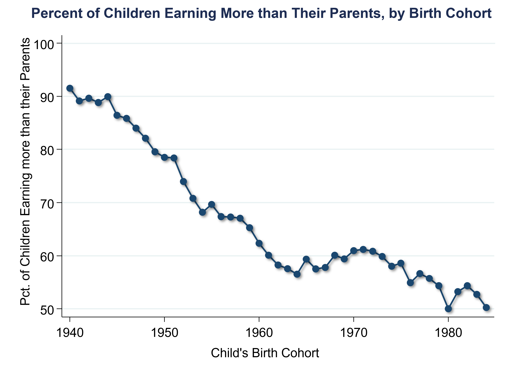
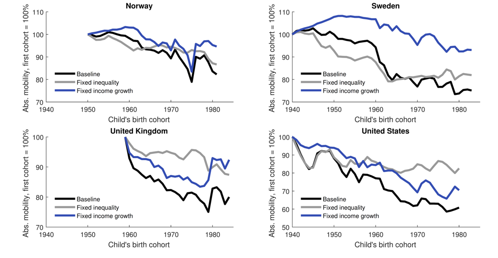
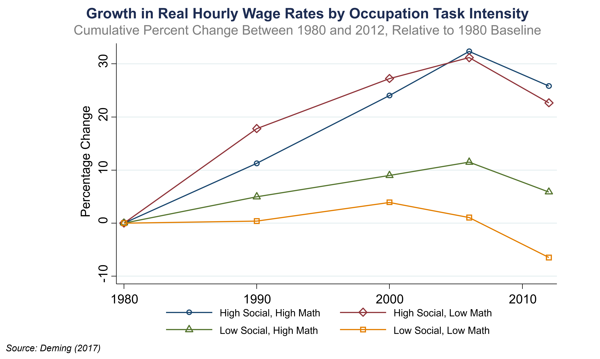

# The American Dream in Historical Perspective {#lec4_mob-hist-int}

## A Historical Perspective on the American Dream

- A historical perspective can often be useful for understanding the determinants of current outcomes. Researchers today can’t yet study mobility by neighborhood because they don’t have historical data linking parents to their children. However, they have made progress in understanding mobility over time at a national level. 

- The American Dream is typically defined as the aspiration that children should end up better off than their parents. To measure this concretely, researchers can look at children’s earnings compared to their parent’s earning. 

## Measuring the American Dream

- The statistic that we are focusing on measuring in the data is the fraction of children earning more than their parents and how has that changed over time. The paper that examines this is: Chetty, Grusky, Hell, Hendren, Manduca, Narang. [“The Fading American Dream: Trends in Absolute Income Mobility Since 1940.” Science 2017](https://www.science.org/doi/10.1126/science.aal4617)

-	The biggest obstacle to answering this question in the past has been that nobody had historical data linking parents to kids. The study in Science circumvented this problem by estimating historical rates of mobility, even in the absence of parent-children links. That method after briefly examining the findings of this paper.  

-	The figure below shows the percentage of children earning more than their parents by the parent’s income percentile. In the 1940s, it didn’t matter what income percentile a child was born into, almost all children earned more than their parents. However, with each passing decade ,there is a dramatic and steady drop in the fraction of kids who are doing better than their parents across essentially the entire income distribution. This is especially true for the middle class, which represents kids born to parents between the 40th and 60th percentile. There’s a dramatic reduction in the odds that you are going to do better than your parents. 


```{r , echo=FALSE, out.width = '90%'}
knitr::include_graphics("images/lec4_hist_mob/lec4_mobhist5.png")
```

-	Another way to examine this is to ask what, “On average what fraction of the kids born in 1940 ended up doing better than their parents did?” The answer to that question is shown in the graph below. In 1940, 92% of kids went on to earn more than their parents. That number has steadily declined

```{r , echo=FALSE, out.width = '90%'}

```

- To compute this series without the parent-child link,s researchers were able to exploit the fact that almost all kids born in 1940 earned more than all the parents in the pervious generation. Thus, it doesn’t matter which kids are linked to which parents. This point is clear when looking at the distribution of incomes of parents in the 1940s and the incomes of children born in the 1940s. 

```{r , echo=FALSE, out.width = '90%'}
knitr::include_graphics("images/lec4_hist_mob/lec4_dist_childparent3.png")
```

-	The key thing to note here is that these two distributions are almost non-overlapping. As a result, there is this situation where almost all kids are earning more than all parents. That means that mobility rates are incredibly high.  This point is not true for children born in later decades, such as the 1980s, however, there are data linking parents to children in the 1980s, which makes the calculation more straightforward because researchers can directly see which children earned more than their parents. 

## What Policies Can Increase Economic Mobility?

- Since 1940, there have been two major changes in the American economy at the big-picture level. First, the total economic growth rate is lower. Second, there is less equal distribution of that growth, with more going to higher-income people than lower-income compared to the past. 

```{r , echo=FALSE, out.width = '90%'}
knitr::include_graphics("images/lec4_hist_mob/lec4_goldin_katz2.png")
```

- This chart is from [“The Race between Education and Technology”](https://www.hup.harvard.edu/catalog.php?content=reviews&isbn=9780674035300) by Larry Katz and Claudia Goldin. The blue bars show how much household income grew for people between 1947 to 1973 based on which income quintile they were in. The lowest quintile saw growth of three percent in these years, which means that their incomes doubled in about 25 years. The red bars show the same statistic but for 1973 to 2013. The red bars are generally lower, which reflects that income growth has slowed in the whole economy. The red bars are also less equally distributed than the blue. This shows two big changes in the American economy in the past thirty years relative to before: lower growth rates and growing inequality.

```{r , echo=FALSE, out.width = '90%'}
knitr::include_graphics("images/lec4_hist_mob/lec4_piketty_saez_zucman17.png")
```

- This graph from a study by Thomas Piketty, Emmanuel Saez, and Gabriel Zucman shows the same statistic but broken down by each percentile in the income distribution. Notice how the curves invert over time. In 1980 (shown by the grey dots), the lower end of the income distribution had the highest income growth rates. In 2014 (shown by the red dots), the wealthiest see the largest growth in their incomes. 

## Policies to Revive Absolute Mobility

-	There are two possible scenarios to analyze to revive absolute mobility. The first is the higher growth scenario. Here, the economic growth rate of the 1940s with income distributed as it is today. The second is the more broadly shared growth scenario. This means that Incomes have the same growth rates as today, but they are distributed across income groups as in 1940 cohort.

-This is the same chart as before. The orange line shows the higher growth scenario and the green line shows the more broadly shared growth scenario. The lesson from this is that 2/3 of the decline in upward mobility in the U.S. over the past fifty years is due to changes in inequality, and 1/3 is due to the reduction in growth rates. 

## Trends in Upward Mobility: International Comparisons

-	Now let’s compare the American experience to trends in other countries. Yonatan Berman applied the methodology from above to several countries across the globe. 

-	This graph is very similar to the above graph except that absolute mobility rates are benchmarked to 1940. Baseline refers to the actual data and the fixed inequality series refers to the higher growth scenario from above. Fixed income growth refers to the higher growth scenario from above while fixed inequality refers to the more equally shared growth scenario from above. Berman then repeated this analysis for several countries, shown below. 

```{r , echo=FALSE, out.width = '90%'}

```

```{r , echo=FALSE, out.width = '90%'}
knitr::include_graphics("images/lec4_hist_mob/lec4_berman18_4.png")
```

- Denmark is interesting because it shows that their incomes have remained distributed in almost the same way since the 1950s. In Denmark, the entire decline in absolute mobility is accounted for by a reduction in growth rates rather than changes in inequality. Denmark has also experienced an overall smaller decline in mobility rates when compared to the US; their total change is about 20% and the US has seen declines of about 40%. 

-	Again, almost all of these countries have that pattern where the blue line looks considerably flatter than the black line. In particular, declining growth explains more than rising inequality in all of the other countries it looks at. This means the U.S. is a bit of an outlier in terms of both the magnitude of the decline and the sources of that decline, coming from changes in the distribution of growth rather than the level of growth. 

## Restoring the American Dream: Two Approaches

-	What types of policies might actually increase incomes in the bottom and in the middle of the distribution? There are two broad approaches that you might think about. The first is redistribution. This can be done through taxes or a minimum wage law. A different approach is to try to increase the skills of lower-income Americans so that they end up earning more money. Economists typically call these human capital development policies. 

-	Piketty and Saez are two economists that have argued that reductions in top income tax rates in the U.S combined with the erosion of unions, and the fall in the minimum wage in real terms has led working-class Americans to fall behind. Broadly, they argue for shifting towards higher tax rates at the top and increase transfers and increase support for incomes at the bottom. 

-	A different view is given by Claudia Goldin and Larry Katz in the book 'The Race Between Education and Technology', where their central thesis is basically that you need education to keep pace with technological change in order to increase wage rates. They argue that education fell behind in the 1980s. 

-	One quick point to make is that education doesn’t just refer to pure technical skills, it can also refer to social skills. Dave Deming has done research on this. 

```{r , echo=FALSE, out.width = '90%'}

```

-	This graph shows growth in hourly wage rates by occupation and he classifies occupations into different types based on the technical skills and social skills they require. The occupations that require high social skills have seen the most growth. Intuitively, as more routine tasks get automated then businesses don’t have to pay as much for workers to fill those jobs because they can automate them. Whereas social skills are very high and very difficult to replicate using at least the technology we have available today. As a result, it's the occupations that require high social skills where wages have grown a lot. 

-	The point is that if one thinks that society needs to increase education as a way to address declining mobility rates then society also needs to think about more than just increasing math test scores. Social skills and other non-cognitive skills also need to be improved.

