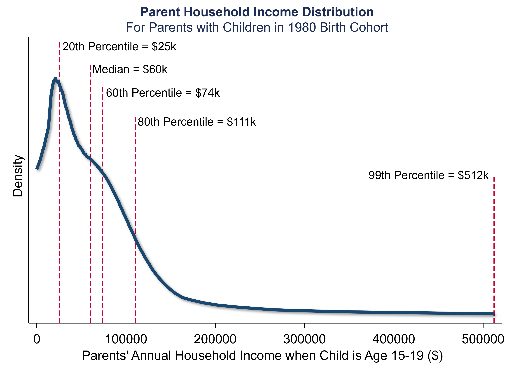
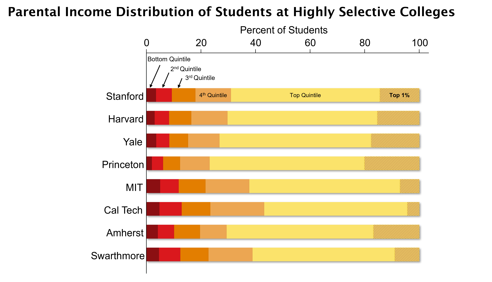
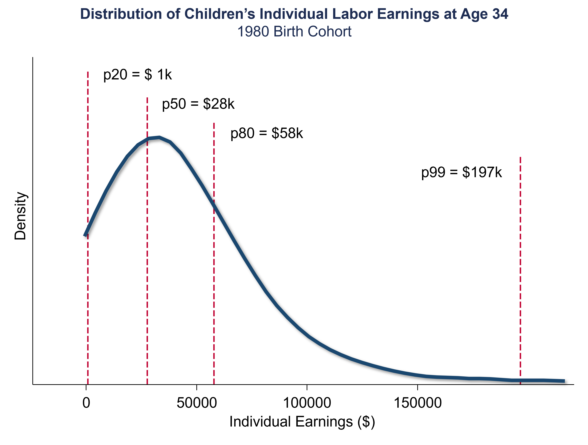
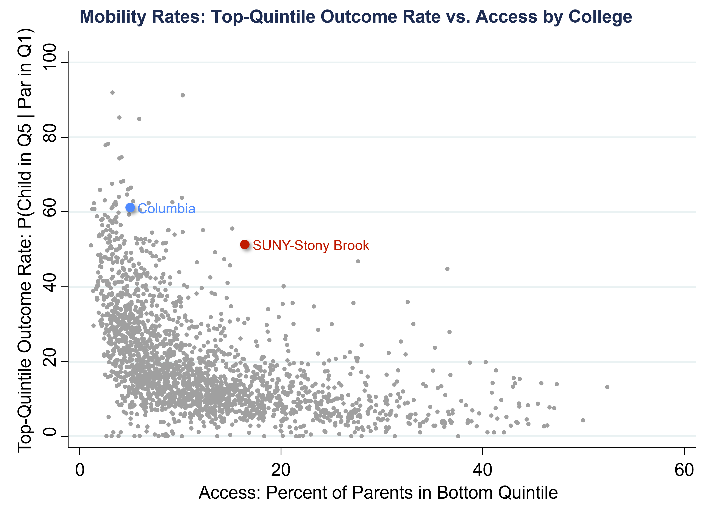
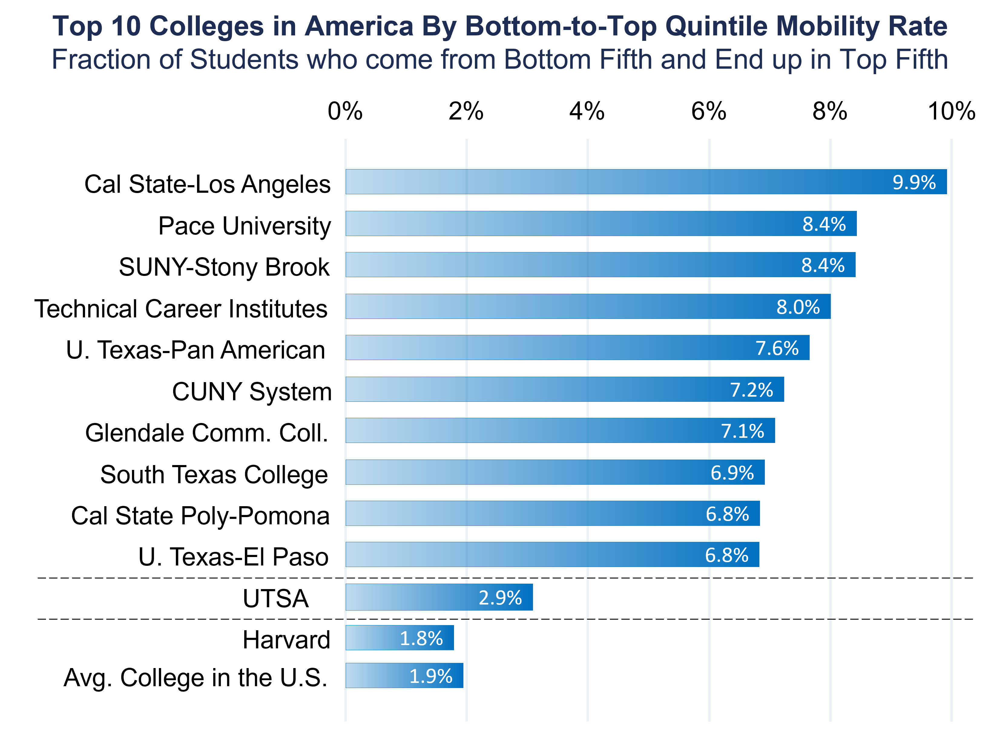

# Higher Education and Upward Mobility {#lec5_mob-ed}

## Education and Upward Mobility

- Education is viewed as one of the most scalable pathways to upward mobility. Education is important in terms of its predictive power, differences in mobility, policy relevance, and changeability. 
- Social capital, family structure, segregation, and other factors may impact long-term outcomes more than education. 
- Education may no longer provide a strong pathway to opportunity in the United States.
    - Lower average standardized test scores compared to other countries. 
    - The local property tax finance system means that kids from disadvantaged backgrounds may not have access to the same quality of K-12 education as kids from more advantaged backgrounds. 
    - The lack of access to higher education for low-income students due to rising costs. 
    - Growth of potentially unhelpful for-profit institutions. 
- Administrative data from colleges and school districts are giving us a much more scientific understanding of the “education production function.” 

## How do Colleges Shape Income Mobility in the U.S.?

- This section is based on [“Mobility Report Cards: The Role of Colleges in Intergenerational Mobility”](https://opportunityinsights.org/wp-content/uploads/2018/03/coll_mrc_paper.pdf)
- Higher education could provide a pathway to upward mobility that is attractive because it's not directly shaped by the neighborhood where a child happens to grow up. 
    - If children from higher-income families tend to attend better colleges, then the higher education system may not actually promote mobility and may worsen it. 

## Effect of the Higher Education System on Mobility

- The effect of the higher education system on mobility across generations fundamentally depends upon three factors:
1. [Inputs] Parental income distributions by college
    a) If there are very few low-income students at a given college, then that college cannot be contributing a great deal to mobility
2. [Outputs] Students’ earning outcomes conditional on parental income by college.
    a)	How do kids from low income families at Harvard end up doing five or ten years after graduation?
3.	[Causal Share] Portion of variation in students’ earnings outcomes that is due to colleges’ causal effects
    a) If it's all about selection and there is no actual treatment effect of attending a different institution, then changing which students attend which colleges may not have a big impact on mobility. 

## Estimating the Three Parameters: Data. 

- We estimate these three sets of parameters for every college in America using data covering all college students in the U.S. from 1990 to 2013 using Income tax and IRS records and data from the Department of Education and the College Board. 
- Based on whether or not you attend a college, not whether you graduate. 

## Parents’ Income Distributions by College: Income Segregation in the American Higher Education System. Measuring Parents’ Income. 

- We're going to define parent income as average pre-tax household income during the five-year period when the child is between ages 15 and 19. We're going to rank parents relative to other parents with children in the same birth cohort. 

```{r , echo=FALSE, out.width = '90%'}

```

- We use the percentile cutoff that's relevant for your birth cohort.
- Whether or not you attend college is strongly related to your parent’s income.
  a) 65-percentage point gap in college attendance between kids from the lowest income families and the highest income families. 
- In the parent income distribution of students by quintiles, if you were drawing uniformly from the U.S. income distribution using random sampling, you'd have 20% in each quintile. 
  a) Instead, your probability of attending Harvard is 103 times higher if you're from the top 1% than the bottom 20%. There are similar trends at other elite universities, especially with legacy admission. 
  a) The percent of students coming from each quintile only increases substantially once you reach the extreme upper tail of the income distribution ($500,000).
  a) Many elite state flagship schools have fewer kids from high-income families than Harvard does, but they do not have significantly more kids from low and middle-income families. 
  a) In many community colleges, you'll see a larger share of low-income students than higher-income students. 


```{r, echo=FALSE, out.width = '90%'}

```

- If you're from a low-income family, you have fewer peers attending your college who are from high-income families than from low-income families. 
- The degree of integration across colleges is mostly similar to the degree of integration across neighborhoods.
    - If you look at the fifth quintile, in both your college and pre-college residential neighborhood, about 10% of the people you're around are going to be from the top quintile on average. 
    - Kids from high-income families at elite universities have fewer peers from low and middle-income backgrounds in college than they did in their own childhood neighborhoods. This pattern continues throughout the income distribution.  

## Trends in Income Segregation

```{r, echo=FALSE, out.width = '90%'}
knitr::include_graphics("images/lec5_mob_ed/frac_peers_topq_topq.png")
```

- Up to 2011, there's no real change in the amount of isolation of kids from high-income families from other backgrounds at either the neighborhood or college level. 
- During 2006-2007, elite private colleges effectively became free for kids from low and middle-income families. 
    - There was not a dramatic change in the fraction of low-income kids attending these colleges. 
- As government support shrinks, many state universities are under increasing pressure to increase tuition and admit more out of state students who tend to be higher income. 
    - They're serving a smaller and smaller share of low-income students.
- There are more low-income kids now attending for-profit institutions and certain two-year community colleges. 
- Combined, these changes essentially leave the amount of segregation in the system as a whole roughly unchanged. 
- To increase the representation of low-income students, colleges must be affordable, but financial aid is not sufficient by itself.  

## Outcomes: Students’ Earnings Distributions

- Some patterns are driven by differences in marriage rates rather than differences in a child's own earnings if you use household income measures in the early or mid-30s.

```{r, echo=FALSE, out.width = '90%'}

```

- Kids from low-income families and those from high-income families had virtually the same likelihood of reaching the top fifth of the income distribution at essentially all of the colleges we've looked at. 
    - Most of the gap in outcomes that we see between children from high and low-income families can be explained by differences between colleges—the colleges they attend—rather than within colleges. 
- Reallocating students across colleges through changing admissions policies could potentially have a significant impact on intergenerational mobility. 

## Differences in Mobility Rates Across Colleges

- Top quintile outcome rate: the fraction of students who reach the top quintile.
- Low-income access: the fraction of parents from the bottom quintile.
- Mobility rate of a college: the fraction of a college’s students who come from the bottom quintile and end up in the top quintile. 
    - This is a joint probability: what's the probability that you both come from the bottom quintile and end up in the top quintile? 
    -  Calculated as low-income access times the top-quintile rate.

```{r, echo=FALSE, out.width = '90%'}

```

- Colleges that serve a lot of low-income kids tend to have poorer earnings outcomes. That could either be because those colleges don't have a great treatment effect or because of selection.
    - Treatment effect: maybe those colleges don't provide good instruction or networks. 
    - Selection: the backgrounds of the kids who attend these colleges are different than those of the kids at Harvard. 
- The Ivy Plus institutions are all concentrated on the upper left of this chart. 
    - Relatively few low-income kids and some of the best earnings outcomes. 
- State public flagships have very good outcomes, but they don't have dramatically higher representation of low-income kids than the elite private colleges.
- The colleges that have the highest mobility rates are in the upper right. 
    - A lot of low-income students and pretty good outcomes for low-income kids. 
    - Mid-tier public institutions like Cal State L.A, Stony Brook, and the City University of New York. 
    - Mobility rates of around 8%, or even 10% at Cal State L.A. 

```{r, echo=FALSE, out.width = '90%'}

```

- If you have relatively few low-income kids, you can't have a lot of mobility, as defined in this way, because you're working with a small pool of low-income kids to begin with. 
- There are very sharp differences in mobility rates across colleges.
- If you want to increase mobility through the higher education system, you want to increase the representation of low-income kids at colleges with the best outcomes like Harvard and the University of Michigan Ann Arbor. 
- There are colleges with many low-income students, but low mobility rates due to poor outcomes. 
    - Improving the outcomes in colleges with poor outcomes involves improvements on the margin, like trying to get kids not to drop out and do better in the college. 
