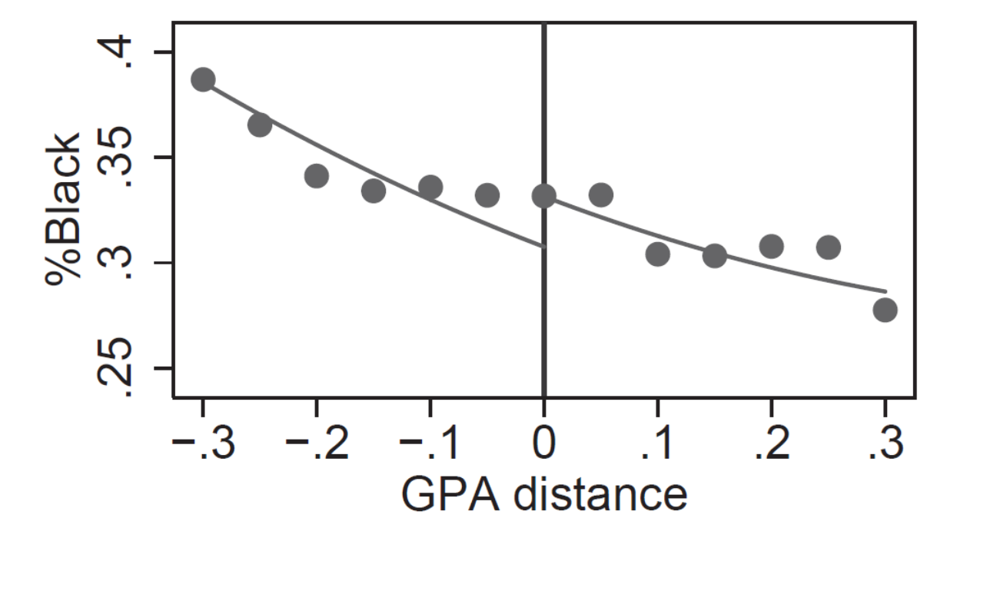
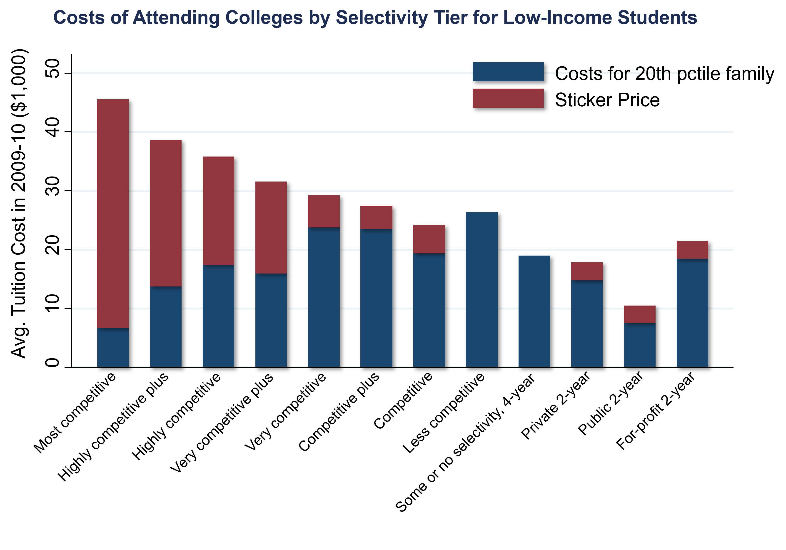

# The Causal Effect of Colleges {#lec6_ed-higher}

## Causal Effects of Colleges

- What fraction of the earnings variation across colleges that is due to causal effects as opposed to selection? 
    - Only selection: students who come to Harvard are a very highly selected group of people and they presumably would have done quite well even if they had gone to college somewhere else.
        - Reducing segregation across colleges through changes in admissions rules would have no impact on economic mobility.
    - Causal effect: value added from attending Harvard; going to Harvard changes your earnings relative to going to your local state school.
        - Changes in admission policies could have a big impact on mobility.

## Estimating the Causal Effects of Colleges

- Ideal experiment to estimate this causal effect: randomly assign kids to all of the different colleges in the U.S. and compare their earnings at age 30. 
    - Instead: quasi-experimental design that effectively allocates comparable students to different colleges.
- We need to find some source of variation that allows quasi-random allocation of students across colleges, to compare students at college A to college B. 
    - 3,000 colleges in the U.S., 3,000 different causal effects. 
    - Ideal: 3,000 different experiments comparing college A to college B, college B to college C…

## Regression Discontinuity Methods

- In this [paper by Seth Zimmerman](https://www.journals.uchicago.edu/doi/abs/10.1086/676661?journalCode=jole), called "The Returns to College Admission for Academically Marginal Students", he estimates the causal effects of Florida International University (FIU) by exploiting admissions cutoffs. 

## Zimmerman Study

- Zimmerman compares students just above, and just below, the state-level GPA cutoff for admission to the Florida State University system. 
    - Depends upon your SAT score, and then the GPA that you need, in order to get into FIU (lowest-ranked four-year state college in Florida).
    - Lots of students with SAT scores slightly below 970. Then think about the student who also has a GPA of 2.99: by this rule, this student is not going to get in, but a student with a GPA of 3.01 will get in. 
    - Exploit this variation to identify the causal effect of attending FIU.

```{r, echo=FALSE, out.width = '90%'}
knitr::include_graphics("images/lec6_higher_ed/zimmerman1.png")
```

```{r, echo=FALSE, out.width = '90%'}
knitr::include_graphics("images/lec6_higher_ed/zimmerman3.png")
```

- Graph on the left: the horizontal axis is how far away your GPA is from the cutoff that's relevant for you, given your SAT score. 
    - If your SAT score was below 970, then zero corresponds to 3.0.
- The vertical access is plotting what fraction of kids get admitted to FIU. 
    - Big jump in adherence with the rule right at the cutoff. Not from zero to 100%—they're not mechanically following this rule.
    - Your odds of getting into FIU are 23 percentage points higher if your GPA happens to be 3.01, rather than 2.99.
- Graph on right: we care about actually attending, not just getting in. 
    - The cutoff actually affects who shows up at FIU, not just the admission margins. 
    - The people on the right of the cutoff are 10 percentage points more likely to attend FIU than the people just to the left of the cutoff.
- Those with a GPA just above the cutoff are the treatment group in an experiment, they got the FIU treatment. Those just below the GPA cutoff are the control group, the people who did not get into FIU. 
    - The control group typically ends up attending a two-year community college in Florida. The experiment is attending a four-year state university, rather than a two-year community college.
- Compare the earnings outcomes of the kids who ended up just above the cutoff (GPA of 3.01), versus the earnings outcomes of the kids who ended up just below the cutoff (GPA of 2.99). 
- Quasi-experiments require an identification assumption that allows you to estimate causal effects. 
    - The assumption must make your quasi-experiment as good as an experiment. 
    - Key identification assumption for regression discontinuity: all other determinants of earnings are balanced (comparable) on either side of the cutoff. 
        - People in the control group are comparable to the people in the treatment group. An experiment guarantees that by randomization. Here we're going to make an assumption that the people with a GPA of 2.99 are pretty similar to the people with a GPA of 3.01. 
- Suppose we make the assumption that those two sets of people are comparable in terms of overall merit, it's just by chance you ended up with a GPA that was a bit lower than someone else. 
    - Then any jump in earnings, at the threshold, when we cross from 2.99 to 3.01, has to be due to the discrete jump of the chance of attending FIU instead of a community college.
    - We can attribute it to the causal effect of attending FIU instead of a community college. 
- Plausible assumption because the admissions threshold was not widely publicized. 
    - If the cutoffs were well-publicized, you might worry that the students just above the cutoff would be different from those just below the cutoff because there's a strong incentive if you want to get into the university to try to do something to get your GPA just over 3.0. 
    - The students who managed to do that maybe have put in a little bit of extra effort, or they came from a certain school where their guidance counselor helped them figure out how to get over the threshold. This is manipulation of the running variable that is creating this regression discontinuity.
- Evaluate the validity of the assumption: make sure the observable characteristics that you can see in the data, students' characteristics, look relatively similar on both sides of the cutoffs. 

```{r, echo=FALSE, out.width = '90%'}

```

- Plot the fraction of students who are black around the same admissions cutoff: that number hovers around 30%, both for the students who are just below the cutoff and just above the cutoff. 
    - If we saw a huge difference here on the left and the right, we don't have a valid experiment; basically, we wouldn't be comparing similar people on the left and the right. 
    - Gender also looks relatively similar. 

```{r, echo=FALSE, out.width = '90%'}
knitr::include_graphics("images/lec6_higher_ed/zimmerman6.png")
```

- Treatment effect of attending FIU: plot mean quarterly earnings around that cutoff. 
    - Administrative data on earnings of students who previously either attended FIU or didn't. Plot earnings now around the GPA cutoff, eight to 14 years after you graduated from high school. 
    - Clear jump in earnings, to the right of the cutoff, relative to the left. The people to the right had a significantly higher chance of attending FIU than the people to the left. Because we assume these people are comparable on other dimensions, we can attribute the $372 jump in earnings at that point to the causal effect of attending FIU instead of your local community college. 
- That's the regression discontinuity method: plot the outcomes, versus the variable of interest, and then look for a jump at the relevant cutoff. 

## Causal Effects of Colleges

- Use earnings controlling for SAT scores, and parent income, as an estimate of each college's causal effect. 
    - Infeasible to do a random or quasi-random assignment at every college; instead, take a set of kids who have the same SAT scores and parent income. Find a set of kids who have those characteristics at Harvard and a set of kids who have those characteristics at the University of Michigan. Attribute any difference in earnings on average, between those two sets of kids, to the causal effect of attending Harvard instead of attending Michigan. 
    - Using SAT scores and parent income to control for selection, or differences in student background, works perfectly if the only dimension on which colleges are actually selecting students is based on SAT scores and parent income. 
- Compare SAT/parent income control method to the quasi-experimental estimates you get at FIU: similar results.
- There is some scope to increase low and middle-income shares at highly selective colleges by admitting and enrolling more high-achieving, lower-income students.
    - It could be because they're not applying, they're not getting in, or they're not choosing to enroll because of the cost. 
- Lower application rates of well-qualified low-income students (undermatching). 

```{r, echo=FALSE, out.width = '90%'}

```

- Cost of college: the red bars are the sticker prices. For a kid from a low-income family the cost that you'd actually face, taking financial aid into account, is shown by the blue bar, which is lower than the cost of going to some of the less competitive schools. At top colleges, cost by itself doesn't seem like the key barrier. 

- Lack of information or support in the application process for low-income students seems more plausible. 

## University of Michigan HAIL Experiment
- Sue Dynarski and peers test this information hypothesis by running an experiment at the University of Michigan (UofM). 
    - High-achieving students: GPA above 3.3 and an SAT score above 1100.
    - Low-income families: kids growing up in families that have an income below about $50,000 a year.
    - Administrative data from schools of every student in Michigan. 
    - Proxy for low-income families: eligibility for a free or reduced-price lunch. 
- Assign 50% of those students, randomly, to receive a treatment of additional information and support to apply to the UofM. 
    - Brochures saying you can attend with free tuition. Everybody was eligible given their income cutoffs. But they're making that very clear. Waiving fees that are often deterrents to applying. Informing them the FAFSA is free. 
    - Reach out to both students and parents with personalized mailing. 
- Controlled treatment comparisons: 67% of the students in the treatment group applied to the University of Michigan, only 26% of the students in the control group did. 
    - 32% of the students in the treatment group got into the UofM; 15% in the control group. 27% of the students in the treatment group are currently attending the UofM; 12% of the students in the control group are. 
- With simple, low-cost mailing, they increased the fraction of highly qualified students who attend the UofM, by about 15 percentage points, doubling the rate of attending the UofM in this group.
    - Students continue to attend the UofM two years after the experimental intervention. 
    - Many of these students would have attended community colleges had they not attended the UofM.
- Removing cost and informational barriers, for high-achieving, low-income students can increase their access to highly selective colleges appreciably. 
    - By itself, this is not the solution. Starting from a pool of 2,000 students, you're increasing the fraction of students who attend the UofM by about 15%, or 300 extra students per year. This will not alone desegregate the higher education system.
- Even if you hypothetically eliminated all barriers, and had pure SAT-based applications and admission, that would not change low-income shares appreciably, especially at elite colleges. 

```{r, echo=FALSE, out.width = '90%'}
knitr::include_graphics("images/lec6_higher_ed/dynarski2.png")
```
