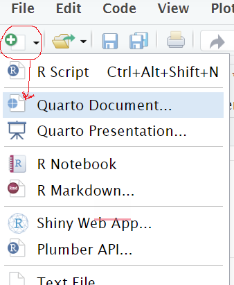
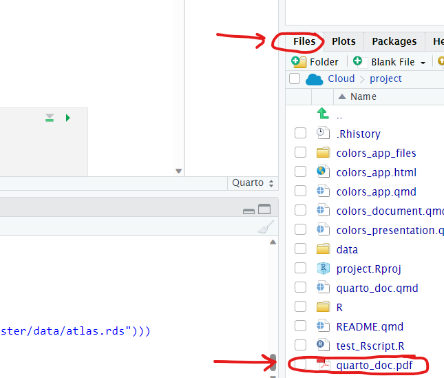
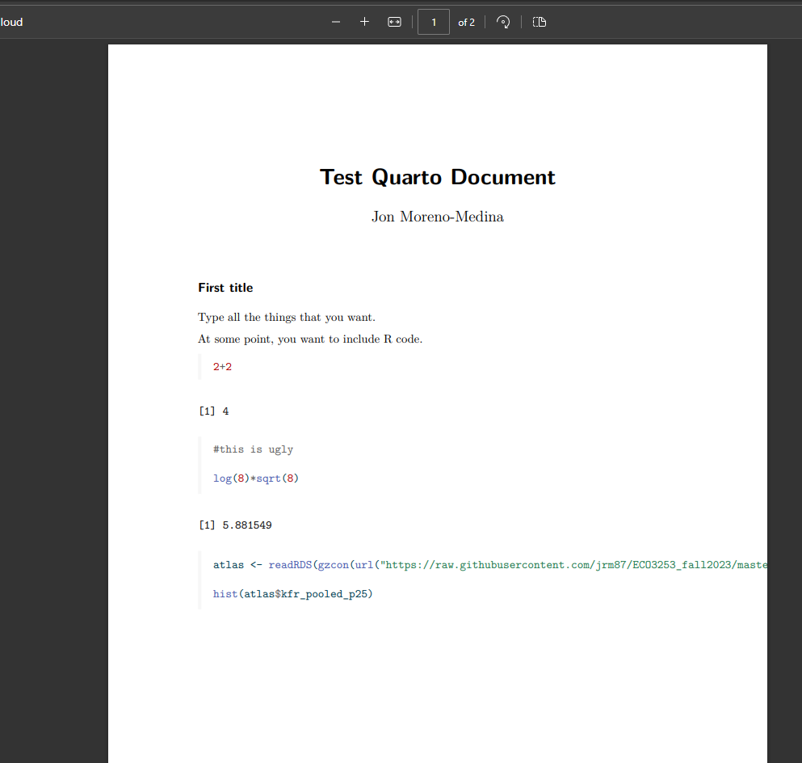
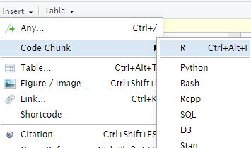
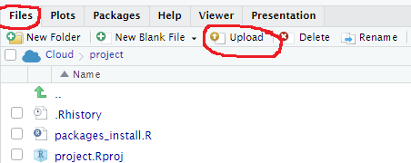
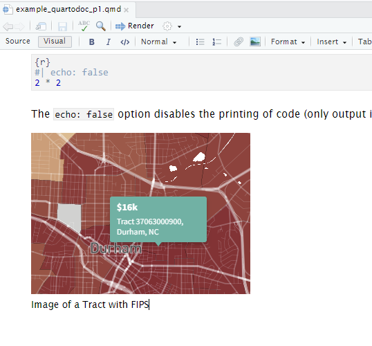

# RMarkdown / Quarto output {#rmarkdown}

```{r, include=FALSE, purl=FALSE}
chap <- 6
lc <- 0
rq <- 0
# **`r paste0("(LC", chap, ".", (lc <- lc + 1), ")")`**
# **`r paste0("(RQ", chap, ".", (rq <- rq + 1), ")")`**
knitr::opts_chunk$set(
  tidy = FALSE, 
  out.width = '\\textwidth', 
  fig.height = 4,
  fig.align='center',
  warning = FALSE
)
options(scipen = 99, digits = 3)
# In knitr::kable printing replace all NA's with blanks
options(knitr.kable.NA = '')
# Set random number generator see value for replicable pseudorandomness.
set.seed(76)
```

How do you put normal writing, analysis, code and output into one file in a simple way? Enter RMarkdown/Quarto! Throughout this semester you will deliver your projects in the form of a RMarkdown or Quarto file. There are several cool options when you use this type of output, but I will only briefly describe what you need submit your work. You are encourage to dig deeper if you want to [here for RMarkdown](https://rmarkdown.rstudio.com/lesson-1.html) and [here for Quarto](https://quarto.org/docs/get-started/hello/rstudio.html). I will focus here on Quarto for practical purposes. 

> RMarkdown and Quarto are almost the same thing for our purposes. Quarto is a new tool that the folks from RStudio developed, but it uses pretty much the same format as RMarkdown, so I will use them interchangably. 

## How to create an output file 

There are several options when creating a Quarto file. You would go to the New file symbol (white page with green plus), and select the **Quarto Document** option

```{r , echo=FALSE, fig.align='center'}

```

Then you select the title for the project you want to create, and add your name for the authorship. Select the **PDF** option (instead of the HTML), but leave all other default options unchanged. Then click **Create**

```{r , echo=FALSE, fig.align='center'}
knitr::include_graphics("images/quarto_newdocument.png")
```

You should have a new Quarto document now. Save it a name by clicking on the floppy disk.

Now just try to render the file. This will create the final PDF document that you need to deliver. To do that, click on **Render** (it as a blue arrow on the top). A new tab or window should open showing you the PDF document. It is possible you see a window like the one below, but in that case, just click on 'Try Again'. 

```{r , echo=FALSE, fig.align='center'}
knitr::include_graphics("images/quarto_newfile_popup.png")
```

Alternatively, you should be able to see the **PDF** on the **Files** tab on the right of the screen with the same name as the document you saved, but with a '.pdf' extension.

```{r , echo=FALSE, fig.align='center'}

```


### Error when rendering file

Maybe you clicked on **Render** and got this message in the **Background Jobs" tab, by the console: 

```
Error in loadNamespace(x) : there is no package called ‘jsonlite’
Calls: .main ... loadNamespace -> withRestarts -> withOneRestart -> doWithOneRestart
Execution halted

R installation:
  Version: 4.2.1
  Path: /opt/R/4.2.1/lib/R
  LibPaths:
    - /cloud/lib/x86_64-pc-linux-gnu-library/4.2
    - /opt/R/4.2.1/lib/R/library
  rmarkdown: (None)

The rmarkdown package is not available in this R installation.
Install with install.packages("rmarkdown")
```

If that is the case, it's because the package `rmarkdown` is not installed. There are a couple of options here. First, if you see a yellow messaage on top of your document, saying that "Package rmarkdown required but not installed.", you can just click in "Install", wait for it to install, and render the document again. 

```{r , echo=FALSE, fig.align='center'}
knitr::include_graphics("images/quarto_rmarkdown.png")
```

Alternatively, you can go to the console and install that package manually  by running: 

```{r, eval=FALSE}
install.packages("rmarkdown")
```

Now click on **Render** once more. It should work, and you should see a new html window with your document. 

Once you Render you should see a new pop up window with the final pdf document, in which this example, would be something like this: 

```{r , echo=FALSE, fig.align='center'}

```

Once more, remember you will be able to see the final pdf document on the bottom right pane called 'Files' with the same name as the main Quarto Document. 

## Add new code

You add code by adding 'chunks' of code. You do that by clicking on **Insert**, then **Code Chunk**, and then **R**.

Also, notice that if you add to the first line of the chunk a line like this `#| echo:false`, then when you render you will not see the code, but only the output of the code. This is convenient when the output is too long or distracting, or when you don't want to show the code necessarily. 

```{r , echo=FALSE, fig.align='center'}

```

## Add a title

If you want to add a new title, just type in the main text the following `## ` (notice the space), and that will give you a Header (or title). You can get subtitles by typing three instead of two pound symbols: `### `. 

## Add an image

What if you want to add an image? For example, you might have downloaded an image like this from the Opportunity Atlas website:

```{r , echo=FALSE, fig.align='center'}
knitr::include_graphics("images/fips_tract.png")
```

How do you add it? Well, you need to do it in two steps. The first, is to **upload** the image to the directory. To do that, go to the **Files** tab, and click on **Upload**, and select your image:

```{r , echo=FALSE, fig.align='center'}

```

```{r , echo=FALSE, fig.align='center'}
knitr::include_graphics("images/quarto_imageupload2.png")
```

You should now see your image in the **Files** tab. Now, you can add the image to the document by clicking on the image symbol on the top (close to the **Insert** option). Then browse and select the image you just uploaded, add a caption for it, and add it. You should then see it in the main document. 

```{r , echo=FALSE, fig.align='center'}
knitr::include_graphics("images/quarto_imageupload3.png")
```

```{r , echo=FALSE, fig.align='center'}

```

## Submit your work

You will submit your pdf files for [Project 1](#project1) and the other projects through Canvas.
