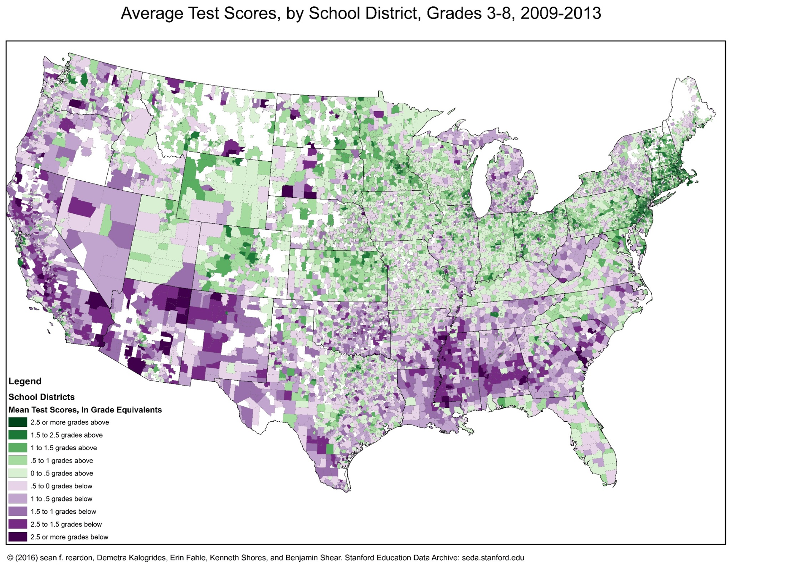
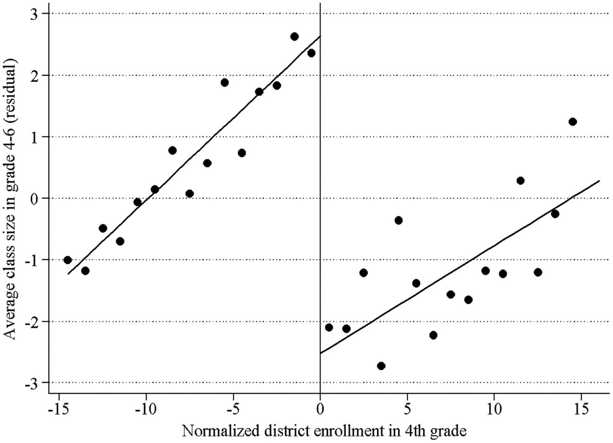

# Primary Education {#lec7_k12}

## A Recap of the Discussion on the Causal Effects of College

- Potential trade-off (value judgment): is there an amount of meritocracy you’ll have to sacrifice in order to increase social mobility? 
    - Meritocracy: the people who are most qualified to get into college should be the ones who get in (Note: SAT score is not a pure measure of merit).
    - Increasing social mobility: giving kids from low-income families access to the types of institutions that might serve as a launching pad to reaching higher levels of the income distribution or other beneficial outcomes.
    - Potential to achieve both of these objectives at the same time. 

##	Questions on Causal Effects of College

- Would the fraction of racial groups at Harvard likely change if we moved to a purely class-based affirmative action system?
    - Yes, significantly. Race plays a very important role even conditional on class and kids' outcomes and qualifications. Race is not interchangeable with class. They're correlated and minorities tend to have lower income. 
    - Admitting more low-income kids would likely result in more low-income white kids. There are a number of more middle-class kids from minority backgrounds who are now admitted at a higher rate. 

##	An Overview of the K-12 System in the US

- In principle, if you improve the environment that kids are born into, you potentially face less of a tradeoff later and have more of an impact.
- The US spends nearly \$1 trillion per year on K-12 education. 
    - Variation in school funding: public schools are funded by local property taxes. More affluent neighborhoods tend to have better-funded public schools than less affluent neighborhoods. You could instead have a national tax base for local schools. 

##	Do Test Scores Predict Long-Run Outcomes?

- Data: standardized test scores at the end of the year obtained directly from school districts. 
    - In the US, there are now standardized tests administered in virtually all states to all students. You see test scores much more quickly than you do long term outcomes.
    - Are test scores actually a good measure of learning? Are they actually a good measure of long-run outcomes? 
- If a teacher is really good at raising kids' test scores, is it that the kids in that classroom are better at taking tests? 
    - Maybe a teacher's really good at teaching to the test and that makes the kids get higher test scores in third grade, but they don’t necessarily do better later in life. 
    - Or is it actually about the acquisition of skills that have value later in life? 
- Data on 12,000 kids who were in various kindergarten classrooms in Tennessee in 1985. 
    - Link the school district data and test score data to the tax records. Then see whether kindergarten test score performance predicts later outcomes. 

```{r , echo=FALSE, out.width = '90%'}
knitr::include_graphics("images/lec7_k12/earningstest.png")
```

- Your kindergarten test score percentile is on the x-axis. Your earnings are on the y-axis. You can see that there's quite a strong relationship between those two things.
- Average incomes go from 10,000 to 25,000. It’s a two and a half fold difference in income but the numbers are relatively low. We're looking at a disadvantaged population in Tennessee. 
- Binned scatter plot: too many data points to see them all, so we show how average incomes vary with test scores by binning the data. We’re dividing the x-axis test scores into 20 equal-sized bins. That means that there’s 5% of the data in each of those bins. Each dot represents the average level of earnings versus the average level of test scores in each of those bins. 
    - Students scoring between the 45th and 50th percentile earn about \$17,000 on average. In all of these bins, we're going to see a lot of variance around those averages. 
- Kindergarten test scores are on average a really good predictor of your future earnings, but they are not perfect predictors. 
    - The R squared statistic, which measures the amount of explained variation in the outcome variable, shows that the test scores explain only 5% of the variation in earnings. 
- Kindergarten test scores are strong predictors of many outcomes to compare performance across schools and subgroups:
    - For those who were at the bottom of their kindergarten class, the college attendance rate is less than 20%. For those who were at the top of their kindergarten class, the college attendance rate is over 80%.

##	Making Test Scores Comparable

- The standardized tests are usually not national tests, so they are not all on the same scale. 
- Sean Reardon created a standardized measure of test score performance for all schools in America. 
    - He used information on 215 million test scores for students from 11,000 school districts across the US from 2009 to 2013 in grades three to eight. 
    - He ranked each school district's average scores within the statewide distribution: from best to worst within a given grade, year, and subject. 
    - He used data from a national test that's administered to a sample of students by the Department of Education every year to convert the state-specific rankings to a national scale. That gives you an exchange rate of sorts between different states, because everything is being put on the same scale in that test. 
	If California students score five percentiles below the national average on the national test. In the district-specific data, suppose you've got a California school that's 10 percentiles below the California average. And we know California on average relative to the nation is five percentile points below the national mean. That tells you that this specific district in California is 15 percentile points below the national mean, because it's 10 percentiles below the California average and California itself is five percentiles below the nation. 
    -  Reardon converted everything into grade-level equivalents: if a kid is reading at a fifth grade level, etc.
    
    ```{r , echo=FALSE, out.width = '90%'}
knitr::include_graphics("images/lec7_k12/achievementdis.png")
```


- Not necessarily about the causal effect of the schools on test scores. 
    - A big part of what's driving this is the socioeconomic status of the students. There are more low-income kids in the districts on the left of this graph and more high-income kids in the districts on the right. 
- In the following graph, purple represents kids who are two and a half or more grades below where they ought to be, given the national average. Green represents kids who are two and a half grades above. 
    - This is somewhat similar to the maps of upward mobility. The Northeast, parts of the West Coast, and much of the Great Plains have particularly good outcomes.
    - This shows how there is tremendous local variation in these test score outcomes.
    
    ```{r , echo=FALSE, out.width = '90%'}

```

##	Achievement Gaps in Test Scores by Socioeconomic Status

- How do test scores vary across socioeconomic groups? 
    - Define an index of socioeconomic status using census data on things like poverty rates, income, the fraction of college graduates, and single-parent rates. There are all correlated with socioeconomic status. Reardon averaged those all together to create an index of places that are basically more affluent versus less affluent. 
    - Plot how many grades ahead or behind your district is versus this measure of socioeconomic affluence. 
- The places on the right side of this graph are very high-income places and the places on the left side of the graph are very low-income places. Each dot represents a different school district and then the size of the circle corresponds to the size of the school district in terms of the number of students. 
- Strong upward-sloping relationship, a lot of the variation in average achievement levels across school districts in the US is likely explained by socioeconomic status. 
    - Variation even conditional on socioeconomic status.
- If you pull out all the Massachusetts school districts and all the California school districts, even at the same level of socioeconomic status, kids in Massachusetts public schools are about one grade level or one and a half grade levels ahead of kids in California. 
    - There's likely something quite different about the school system in California. 
- Another way to cut the data separately is by cutting on the student’s own parents' income using a free and reduced-price lunch measure. 
    - Cutting each school district into two groups: red (nonpoor) and yellow (poor).
    - The gap in achievement between low and high-income kids is actually larger in the best school districts. The higher-income kids benefit a lot from being in these more affluent places and the lower-income kids only benefit a little bit. 

```{r , echo=FALSE, out.width = '90%'}
knitr::include_graphics("images/lec7_k12/academicses3.png")
```

- The US often doesn't do very well in terms of average test scores in comparison to other countries. 
    - Plot average test scores versus average spending in primary education, you don't see a strong relationship. Spending more money might lead to better outcomes, but the core reason the US has poorer performance is not that we spend dramatically less money on education than other places. 
    - Lots of countries spend less per pupil than the United States and have dramatically better outcomes on the PISA test. 

##	Two Policy Paradigms

- Government based approach: how do you improve public schools by doing specific things to them (reducing class size, increasing teacher quality, etc.).
- Private market forces: instead of providing education, the government only funds it.

##	Government Based Solutions to Improving Schools

- The education production function: 
    - Output: student learning, which may be measured by test scores. 
    - Inputs: things you can control, such as the number of students in each class, the types of teachers you hire, and technology.
    - Restricted by your budget.

## The Effect of Class Size 

- Can't just compare year-end test scores of classes that are smaller to classes that are bigger. 
    - This is an invalid estimate of the causal effect, because students in schools with smaller classes will tend to be different in many other ways: higher income backgrounds, from school districts with more money, which are the ones that can hire more teachers. 
    - Overstates the effect of class size: kids in small classes do much better, but it might be because of other things that are correlated with being in a small class.

### The Tennessee Star Experiment

- The Student Teacher Achievement Ratio experiment aimed to understand whether class sizes affect student outcomes. 
    - Between 1985 and 1989 in Tennessee they took about 12,000 kids in grades K through three at 79 mostly disadvantaged schools. They randomized students and teachers into classrooms within each school. Student who got assigned to small classes had an average of 15 students in their class; students assigned to large classes had 22 students on average. 
- Compare the average outcomes of kids in small versus large classes. 
    - Random assignment means their characteristics will be comparable on average.
- Comparison of means: 
    - Indicator variable: a variable that takes two values, zero or one. Zero signifies being in a large class, one means the student was in a small class. 
    
```{r , echo=FALSE, out.width = '90%'}
knitr::include_graphics("images/lec7_k12/star1.png")
```

- Regression table: 
    - Top row: the dependent (outcome) variable.
- First column: the dependent variable is test score. The first number reflects the impact of being in a small class. It is the coefficient when you regress test scores on that indicator for being in a small class. The kids randomly assigned to the small class are doing 4.8 percentile points better on average than the kids in the large class. 
    - The number you see underneath in parentheses is the standard error. If I repeated this experiment thousands of times, I won’t always get 4.81. The standard error is a way of quantifying how much uncertainty there is in the estimate due to random chance (margin of error).
- Use the standard error to construct the 95% confidence interval. 
    - The 95% confidence interval is plus or minus 1.96 times the standard error. Suppose we were to repeat the Tennessee STAR experiment 100 times; 95 of those 100 times, we would expect the estimate to lie within the 95% confidence interval. We're decently confident that there's a significant effect of being in a small class: three to seven percentile points. 
- The average test score in this sample is the 48.6th percentile. Our estimated effect says you're going up 4.8 percentiles relative to that average.
- Second column: your probability of going to college goes up by about two percentage points if you were assigned to a small kindergarten class. 
    - We’re evaluating the effect of being assigned to a small class for one year. Being in a small class with the same effect for multiple years would have a more significant effect. Having two percentage points higher probability of going to college for each year of exposure to a small class is going to give you about a 20 percentage point impact from reducing class size throughout school. 
- Third column: the earnings estimate is minus \$4, which is basically zero. 
    - Concluding that putting kids in smaller classes doesn't improve their earnings is incorrect. The 95% confidence interval (plus or minus 1.96 times 327) for the earnings impact is very large. The estimate could be anywhere from minus \$640 to plus \$637 of annual income per year relative to an average of 15,000. It’s possible that placing children in a smaller class for just one year increases their earnings by as much as 4%. 
    - This estimate of minus \$4 means you don't have enough data to say for sure whether small classes matter or not for earnings. 
- Class size seems to increase test scores. There's some evidence that it increases college attendance rates. But it's too small to estimate the impacts of class size on earnings precisely. 

## Class Size Cutoffs in Sweden

- Fredriksson et al use administrative data from Sweden for a quasi-experimental method, regression discontinuity, with more precise results.
- Sweden imposes a maximum class size of 25 students. If your school has 26 students, you split your grade into two classes of 13 students each. If you have 25 students, you could have one class of 25 students. 
    - When you cross this threshold of going from 25 to 26 students, the average size of the class that students are in is going to suddenly fall. This will happen every time you cross an integer multiple of 25. The schools that happen to have 26 students in a given grade are likely to be very similar to the schools that happen to have 25 students just by chance in a grade. That allows you to identify the causal effects of class size by comparing the outcomes of students in schools with 26 students versus 25 students in a given grade. 
    
```{r , echo=FALSE, out.width = '90%'}

```

- The vertical line is the cutoff for maximum class size. The x-axis is distance from the cutoff: zero is the point at which you cross that threshold. The vertical axis is the average class size that students are actually in versus the enrollment relative to the threshold in that grade. 
    - Right when you cross that threshold, when you have 26 students instead of 25, the average class size falls by on average about five students. That five-student reduction in class size is basically a treatment for the kids who happen to be just on the right relative to the kids who happen to be in schools just on the left of the threshold.
- The underlying assumption that we're going to make is that there's no other difference for the students who happen to be just to the right relative to just to the left. 
    - That appears to be the case if you look at the characteristics of students.
- There’s a declining relationship between test scores and class size. 
    - Clear jump right when you cross the cutoff: when the average class size in your school is five students smaller, your test scores go up by about 0.2 standard deviations (y-axis unit).
- Earnings jump by about 4% at the cutoff. 
- The quasi-experimental methodology is consistent with the Tennessee STAR experiment and suggests that class size has important impacts not just on student achievement as measured by test scores but on later outcomes as well. 
- Reducing class sizes in primary school by hiring more teachers can have quite large returns. 
    - If you take a kid in a family at the 25th percentile in the US and add up their total earnings over their life, on average it's going to be \$1.3 million. But money earned 50 years from now is worth less than money earned today, because money earned today can be invested and grown (present value). 
    - If you put less weight on the income of these children based on how far in the future that income is earned and then sum all of those figures up, the cash equivalent in terms of average earnings today for a child born to a low-income family is about half a million dollars. 
    - If we put a single kid in a smaller class, that's going to increase the present value of their lifetime earnings by about \$20,000.  

##	Questions on Primary Education

- The first test in Tennessee you said found the size of a one-year effect. Is the Fredriksson also the one-year effect of smaller class size? 
    - You should interpret it as basically the effect of a one-year difference in class size.
- Is it reasonable to expect that if we scale this everyone will do better? Or at some point will one group of students lose as another group gains?
    - Our studies involve partial equilibrium: we're changing one kid's environment and looking at the impacts on that kid's earnings, holding fixed everything else in the economy. But general equilibrium asks does the equilibrium itself change if you put everybody in smaller classes? 
    - Say you put everybody in small classes. You might see that for a given kid if they're in a smaller class, they're more likely to get into Harvard. That doesn't mean the total number of kids who go to Harvard is going to change. There's 100% crowd out effect: if you do better, I do worse.
    - Human capital building: you're smarter because you were in a smaller class, so you invent new things. That just allows you to earn more and doesn't take away my slice of the pie. 
    - When you have millions of people getting more education because the minimum drop out age changed, crowd out effects are not that large, so most of it is about making people more productive than competing for the slice of the pie in a zero sum game. Just from this evidence, you wouldn't necessarily be able to tell. 
- When we talked about moving to opportunity, we saw that lower-income kids gained from moving to higher resource neighborhoods. And yet the data you just showed up says that low-income kids in high resource schools do worse than their peers. Is this possible?
    - Low-income kids do better from being in a more affluent school district, but high income kids do even better, so the gap gets worse. 
    - With moving to opportunity, it wasn't just about average outcomes. Lots of other things mattered in terms of defining a good neighborhood and a good school. So there might be ways to help people move to opportunity which is not just on the dimension moving to the right side of that chart. You're going to the same school; it's just the size of the class you're in. 

