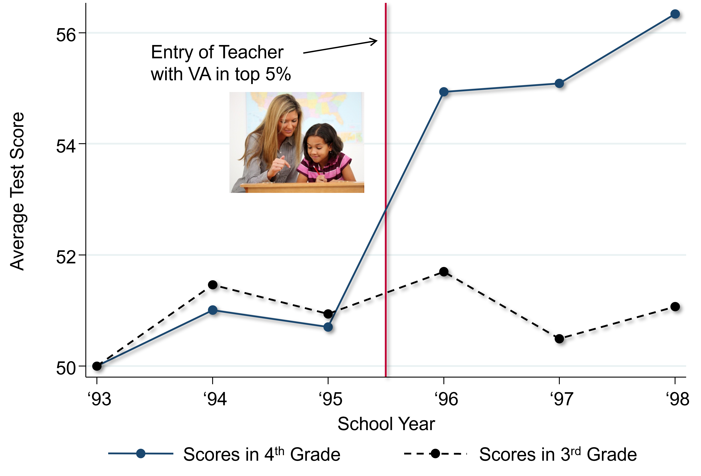
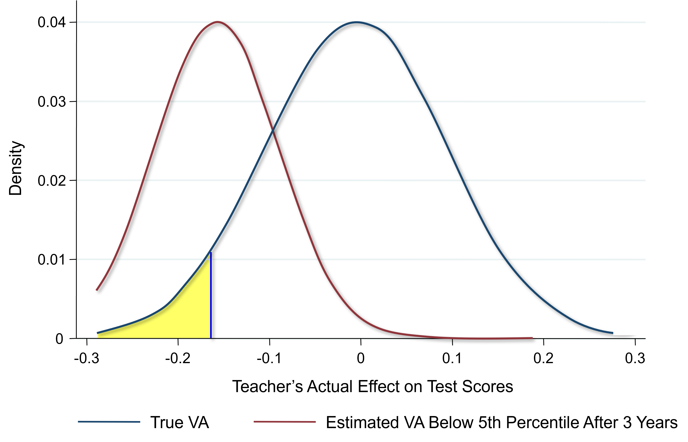

# Teachers and Charter School {#lec8_teachers-charters}

## Using Big Data to Study Teachers’ Impacts

- John Friedman and Jonah Rockoff use data on all kids who went to New York City public schools between 1989 and 2009. 
    - Link that information to the information from tax records so that we can look at kids' earnings, college attendance rates, teenage birth rates, and various other outcomes. 

## Measuring Teacher Quality: Test-Score Based Metrics

- One measure of teacher quality: ‘teacher value-added’ or ‘test score-based metrics of teacher performance’. 
    - How much does a teacher raise his or her students' test scores on average?
    - Example: for a fourth grade teacher, my value-added is my students' average test scores at the end of fourth grade minus their average test score at the beginning of fourth grade or at the end of third grade. 
    - Adjust for noise and control for differences in student characteristics. 
    - If my students’ test score performance is much higher at the end of fourth grade than it was at the beginning of fourth grade, I'm a high value-added teacher. 

## Debate about Teacher Value-Added Measures

- Potential for bias in these measures of teacher quality.
    - Sorting versus causal effects: do differences in test score gains across teachers capture the causal impact of that teacher or does it capture differences in the types of students that different teachers happen to get? 
- Lack of evidence on teachers' long-term impacts: are these teachers who raise test scores actually good at improving students' long-term outcomes or are they good at teaching to the test? 
- Potential instability of value-added estimates: 
    - When you only have a few classes of data, these estimates could be too unstable to be useful inputs in evaluating teachers. 

## Measuring the Impacts of Teachers

- Ideal: randomly assign students to teachers with different levels of value-added. 
    - Identify with the historical data some teachers as being high value-added, some teachers as being low value-added. 
    - Take a fresh set of students and randomly assign those students to teachers and see what happens to their outcomes. 
- In practice: use a quasi-experimental approximation. 
    - Exploit the high turnover in teachers across school years. 
    - If a high value-added teacher enters a new school in a given year, you can compare students' outcomes before that high value-added teacher entered versus after. Like an experiment because from the students' point of view when that teacher happened to show up is essentially random. 

```{r , echo=FALSE, out.width = '90%'}

```
 
## A Quasi-Experiment: Entry of a High Value-Added Teacher

- Event study design example: tracking a given school in New York City over time. 
    - Take fourth graders in the school who get to fourth grade in different school years: fourth graders in 1993, fourth graders in 1994, etc.  
    - At the end of the 1995 school year, a new teacher who comes in who's in the top five percent of the distribution in terms of their teacher value-added. 
    - Average over thousands of such events. 
    - Test scores immediately jump up and stay high as this teacher continues to teach subsequent cohorts of kids in the school. It looks like a significant causal effect on raising the average performance of students in fourth grade in this school. 
- The treatment group experiences the entry of the new teacher.
    - Worry that when this better teacher came in, that was correlated with other changes in the school that benefited kids and this is not all the causal effect of the teacher. 
    - Control group: test scores for third graders in each of these years. The new teacher shouldn't have any impact on achievement in third grade because those students haven't had the better teacher. Third grade test scores are flat around the point when the new teacher comes in fourth grade. 
    - If you get a better math teacher, math scores go up and English scores do not. 
- The year of entry is the year of the event, zero. Think about time relative to that year. Re-normalize the point of entry to be zero for all of these 2000 different events in the data. Take all of those events and stack them on top of each other and then take an average in the year before entry, the year after entry, etc. 
- The entry of a teacher in the bottom five percent of the distribution of value-added immediately pulls down test scores relative to the prior grade. 
- The best teachers having a positive impact, the lowest-rated teachers have a relatively negative impact, and then it's mostly linear throughout the distribution. 
- Where you have good teachers entering might be different in the base years from where you happen to have the lower value-added teachers entering. 
    - Focus on the change exactly around the point of entry. Don't just want to compare across schools, since there are lots of differences across the schools that might generate differences in scores. 

## Lesson 1: VA Estimates are Unbiased Measures of Teacher Effectiveness

- Being assigned to a teacher who is a 10 percentile higher value-added teacher does raise students' scores by about 10 percentiles. 
    - If I estimate value-added in observational data where there's no random assignment of students and I find one teacher is 10 percentiles higher value-added than another, the vast majority of that difference reflects a causal effect, shown by the fact that if I randomly assign or quasi-randomly assign a new set of students to those teachers, I get about a 10-percentile point difference.
- Kids who were assigned to a higher value-added teacher in third grade are significantly more likely (two percentage points) to attend college than kids who are assigned to lower value-added teachers. 
    - This is the causal effect of having a higher value-added teacher for a single year. If you have a higher value-added teacher in third grade, and fourth grade, etc., that can add up. 
    - These value-added measures are actually picking up quite a bit of variation in what teachers do in terms of later outcomes.
-  If you're assigned to a higher value-added teacher, you tend to have higher earnings than if you're assigned to a lower value-added teacher. 
    - Noisier because earnings are much more variable than the zero-one college attendance variable.  
- Girls who have lower value-added teachers are significantly more likely to have teenage births than girls who have higher value-added teachers in elementary school. 

## Lesson 2: VA Estimates Based on Test Scores Predict Teachers’ Long Term Impacts

- Take the bell curve of teacher quality as measured by teacher value-added estimates. Identify the teachers who were in the bottom five percent. Give them training or hire new teachers such that we bring them up to average quality. 
    - That would increase the lifetime earnings of a single child by \$80,000: a couple thousand dollars a year, added up over 40 years. That is a gain of about \$2.2 million per classroom. 
    - Money 50 years from now is worth less than money today. Discount the future stream of payments back at a five percent interest rate (high), you end up with a present value of about \$400,000. 

## Lesson 3: VA Estimates Based on a Few Years of Data are Sufficiently Reliable to Generate Large Gains on Average

- The \$400,000 gain overstates the feasible gain because I assumed we knew with perfect certainty every teacher is value-added. 
    - Value-added estimates based on just a couple of classes are going to be statistically imprecise because teachers who happen to have students who do well by chance will get a high value-added score. 

```{r , echo=FALSE, out.width = '90%'}

```
 
- Identify the teachers in the bottom five percent of the distribution of value-added. 
    - Ideal: identify those guys in the bottom five percent highlighted in yellow. 
    - In practice: given only a few years of classes to look at per teacher, the true value-added of the teachers who we identify might not actually be the bottom five percent. Some teachers’ true value-added is going to be relatively good at the 25th or 30th percentile, but whose estimated value-added after three years is in the bottom five percent. 
    - Those teachers happen to end up in the bottom five percent just because they had a bad day on the test, etc. But essentially no teacher whose true quality is above the median will get rated in the bottom five percent just because of random chance. After you've taught for three years, you have enough information to not identify teachers completely incorrectly. 
    - Quantify how much of a gain you get when you have limited data to measure teacher quality.
- Hypothetically, if you perfectly measure teacher value-added, you would gain \$407,000 from replacing teachers in the bottom five percent with teachers of average quality.
- What is the gain you can actually achieve if you use one year of data to estimate teacher quality, two years of data, etc.?
    - Those numbers are lower because you're going to make a bunch of mistakes. But once you have two or three years of data, that number quickly reaches about \$250,000. Waiting beyond that point doesn't get you that much more information. 

##	Policy Impacts

- In most districts in the U.S., at most public schools, 98% or more of teachers get tenure within three years and there's no performance evaluation. Pay is set purely based on experience.
- Reducing class size can be quite valuable, but it's absolutely critical to hire highly effective teachers if you're trying to reduce class sizes. If I were to pick between having better teachers and smaller classes I would probably pick better teachers. It all depends upon the magnitudes: if you're talking about a dramatically better teacher that's going to have much higher value. It's imperative that we do more to retain and attract top teachers in public schools. Build better methods of evaluating the quality of teachers: classroom ratings, student evaluations, what principals think, etc. Figuring out how you get the best teachers in our public schools can have enormous returns for the country and really improve rates of upward mobility, especially in disadvantaged schools. 

##	Market Based-Solutions: Charter Schools

- Idea: leverage market forces by permitting school choice. 
    - If you've got a really good school, it might attract more students in equilibrium and other schools will have to compete and improve their game in order to stay in business. 
- Charter schools: publicly funded but independent of the public school system. 
- Voucher system: rather than paying tax dollars and then having to use that money in your local school, you get a voucher from the government and you can use that voucher at a private school or any school you want that you choose.
 
##	Do Charter Schools Work?

- You can't compare outcomes at charter schools and public schools because charters, in particular, tend to be started in lower-income urban areas and disadvantaged areas (selection bias). 
- Estimate the effects of charter schools on students' outcomes by exploiting lotteries for admission—an experiment. 
    - Compare the people who won the lottery and the people who didn't win the lottery and see how well they're doing in terms of later outcomes (Josh Andres and Perog Puttock).
- Compare the effects of charter schools and pilot schools in Boston. Charter schools are exempt from all public school regulations. Pilot schools are like charters, but they're covered by the Boston public school regulations and by teachers' union contracts. The tax payment that your public school would've gotten gets transferred to the charter or pilot that your kid actually attends. 
- The kids who, through pure chance, got into charter schools are doing quite a bit better than the kids who ended up going to public schools. But the kids who got into pilot schools get no gain. 
    - The flexibility that the charters have to potentially hire better teachers and structure things in different ways, is likely leading to significantly better impacts in this particular context relative to public schools. Boston charters also improve later outcomes like college attendance rates. 
- Across the country, there are small, positive effects on test scores on average, but there's a lot of variability across different types of charters. 
    - No excuses schools tend to have the most positive impact. They tend to be academically rigorous schools where you have extra hours. It's not that the students have no excuses, it's that teachers take the view that they have no excuse for any child underperforming (KIPP schools). 
- Does market discipline in the school sector lead to the growth of better schools and improvement in performance over time? (Rick Stanusheck) 
- The distribution of the quality of schools measured in the same value-added ways. 
    - How much did students' test scores go up when they attend a given school? The distribution of their value-added estimates for Texas public schools is very sharply peaked around the median, meaning all Texas public schools are kind of similar to each other. In 2001, there's a pretty broad distribution for the charter schools. The peak of it is slightly to the left of the Texas public schools. The average charter in Texas was probably a little bit worse for kids than the average public school. 
- Those charters that were on the far left at minus one standard deviation or below were really not doing well in serving kids and are not there anymore. There's some shift upward and reduction in variance in the quality of schools, exactly as you might expect to happen over time in any market. 
- Three key limitations of market competition of the pure private market approach:
    - Markets generally function poorly when quality is not well observed. You would like to measure value-added looking at longer term impacts, which takes many years.
    - Cream skimming: private schools have an incentive to reject less qualified applicants. This can exacerbate inequality by leaving less qualified students behind because they're not able to get into these better schools. They’re left behind in a public school that has fewer resources and perhaps weaker peers because all of the better students now got cream skimmed out into the charter school. 
    - Markets tend to work well when you can rely on people to make good choices. Families, especially low-income families, don't necessarily choose the best charters. This can amplify inequality. 
- It's not obvious that you actually want to go to a strict market-based approach. 
    - The current constraints in the public school system, like regulations on teacher hiring, limit its effectiveness to some extent, but an unregulated market system, while it might improve outcomes on average, could deliver very variable outcomes across schools, for different subpopulations. 
    - Hybrid system might be best: preserves flexibility within schools while offering uniform quality and resources across schools.  

    


