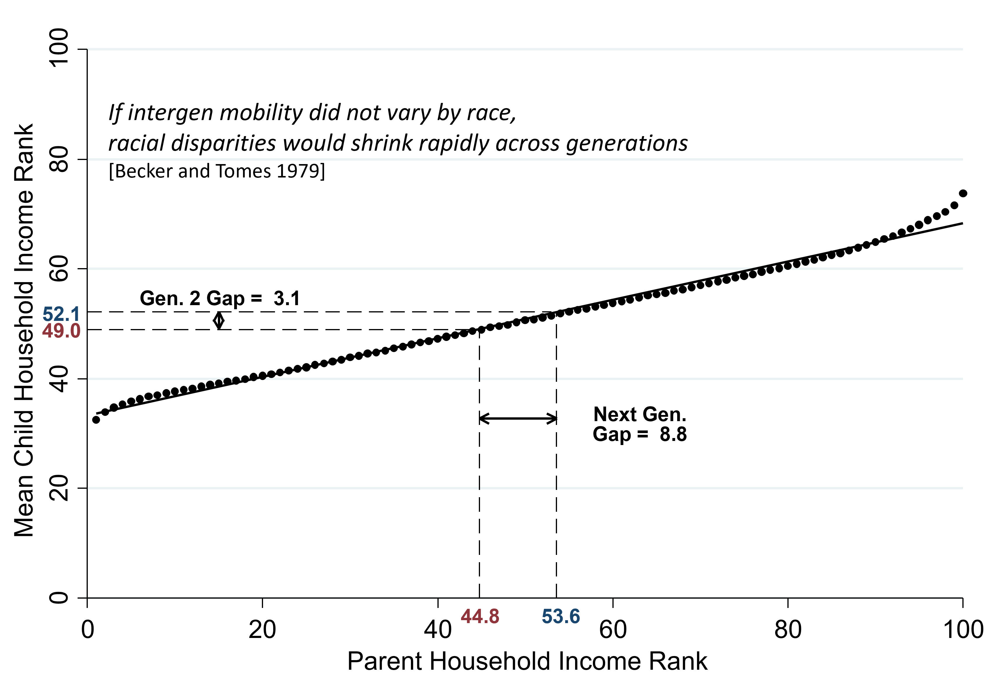
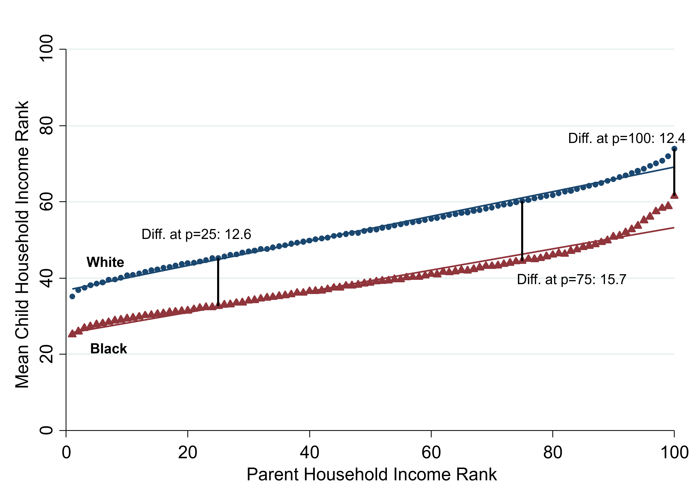
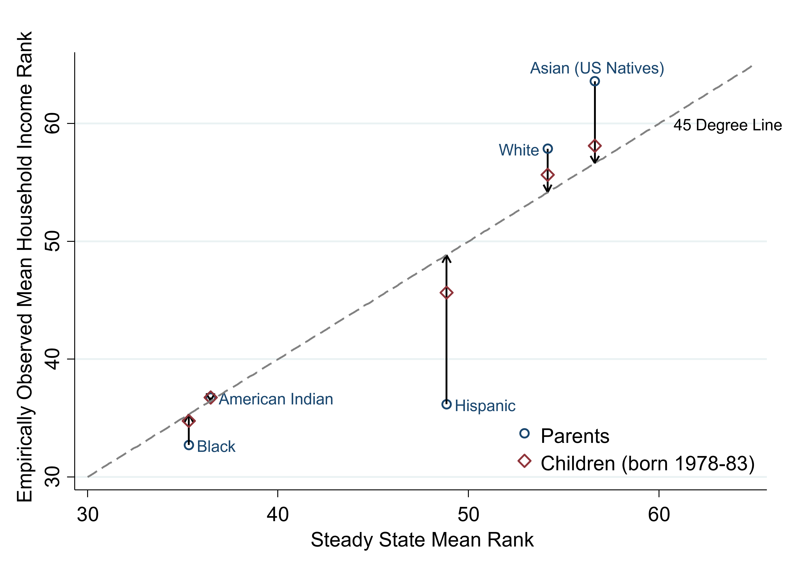
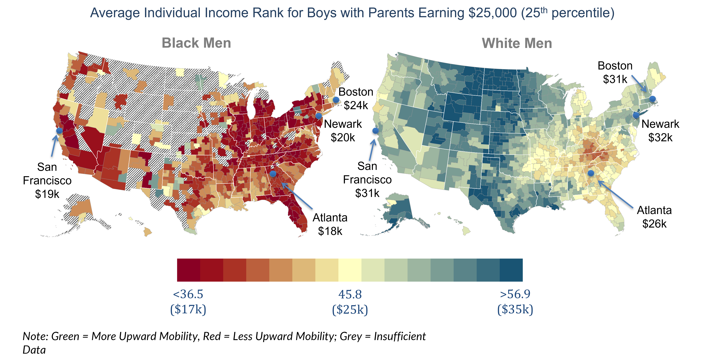

# Racial Disparities in Economic Opportunity {#lec9_race-ineq}

##	Introduction

- Median household income in 2016: \$63,000 for white Americans, \$38,000 for Black Americans, \$80,000 for Asians, \$46,000 for Hispanic Americans, and about \$40,000 for Native Americans. 

##	Theories of Racial Disparities

- Theories: family-level factors, differences in parental income, wealth, education, or family structure.  
    - Black kids are much more likely to grow up in single-parent families than white kids are. 
- The most prominent set of theories focus on structural features of the environment. 
    - William Julius Wilson: segregation of American cities by race is highly detrimental for black kids and isolation from where the good jobs are located might be very problematic for Black Americans. 
    - Differences in school quality that black and white kids experience, discrimination in the labor market, and discrimination in the criminal justice system. 
    - Cultural factors and social norms: identity, oppositional norms, aspirations, and role models.
 
##	An Intergenerational Perspective on Racial Disparities

- Most of the prior work on racial disparities studies disparities within a single generation. 
- Intergenerational perspective: types of disparities that are likely to persist in the long run and isolate the exact factors that drive the persistence of these gaps. 
- An analysis of the dynamics of income and steady states (like stochastic processes). 
    - If you have a system that's going forward over time and there are certain dynamics in it, where is it going to converge? Where is it going to reach a resting state? 
 
##	Intergenerational Mobility in the U.S.

- Plot the average income percentile of kids versus their parents' income percentile. 
    - Strong upward sloping relationship. On average, kids born to richer parents end up having higher incomes themselves. 
    - Approximately linear: there's about a 35 percentile point difference in terms of where kids born to the highest income families end up in the income distribution on average versus kids born to the lowest income families.  
- Hypothetical: both black and white Americans faced the same intergenerational mobility curve that's plotted below in black. 
    - That intergenerational mobility curve allows you to then make a prediction about what is going to happen in the next generation to average incomes. 
    - The average black kid is growing up in a family at the 33rd percentile. If you read off of that black line, it tells you that kids at the 33rd percentile, on average, end up at the 44.8th percentile themselves in the next generation. 
    - The average white kid is growing up in a family at the 58th percentile. White kids would end up at the 54th percentile. 
    - You have an initial gap of 25 percentiles between black and white kids in the parents’ generation. But, in the next generation, that gap shrinks down to 8.8 percentiles if both black and white kids have the same intergenerational mobility curve. 

```{r , echo=FALSE, out.width = '90%'}

```
 
- You don't have perfect persistence of income across generations: some mobility upward for kids born to low-income families and some downward mobility for kids born to high-income families, so the gap is going to shrink over time if blacks and whites have the same rates of intergenerational mobility. 
    - The gap is going to shrink in proportion with the slope of this relationship. The slope of this relationship is .35, and 8.8 is .35 times 25.2. Each generation, the gap is going to shrink to about one-third of what it originally was. If intergenerational mobility does not vary across groups then racial disparities would shrink at an exponential rate across generations (Gary Becker).

##	Intergenerational Mobility for Whites vs. Blacks

- Looking at the data, rates of intergenerational mobility are not the same for blacks and whites. 
- We are plotting that same intergenerational mobility curve but splitting it out separately for whites in blue and blacks in the red triangles. Black kids born to families at the 25th percentile of the income distribution end up 12.6 percentiles points lower in the income distribution than white kids growing up in families with comparable incomes. There's a tremendous gap in terms of rates of upward mobility for kids growing up in low-income families by race. 
    - The gap is almost exactly the same at the 75th percentile and even the 99th percentile. 

```{r , echo=FALSE, out.width = '90%'}

```
 
- Black kids growing up in the highest income families in the U.S. still have significantly lower incomes in adulthood than white kids growing up in similarly affluent families. Black kids have lower rates of upward mobility than white kids at the bottom and much higher rates of downward mobility than white kids. 
- New York Times data visualization using our data: income mobility for black versus white kids growing up in high-income families. 
    - Take a set of kids who grew up in families in the top fifth of the income distribution and ask, in which fifth of the income distribution did these kids themselves end up in adulthood? 
    - As a black kid, even if you grew up in a high-income family, you have a tremendously high chance of ending up in the bottom fifth or the lower middle class. 
    - If you're a white kid who grew up in an affluent family, you tend to stay high-income. 

##	Steady States

- Intergenerational mobility charts: if the slope is below one, then we’ll converge to an equilibrium where the previous generation and the next generation are going to have the same income: the steady state of the system. It's the stable point, the equilibrium. 
    - Where the two mobility curves intersect the 45-degree line. The steady-state prediction for whites based on this intergenerational mobility curve is 54.4. The steady-state prediction for blacks is just 35.2. The steady-state gap of 19.2 percentiles is roughly equal to the current gap that we actually see between blacks and whites, 21 percentiles. Racial disparities are going to persist in a steady state. 
- The fundamental reason that we have persistent black-white gaps in the US over hundreds of years is that there are different rates of intergenerational mobility. 
- The gaps in income that we see in the data between blacks and whites are driven by these differences in rates of mobility rather than transitory factors that might vanish over time. 
- In order to really have an impact on racial disparities in the long run in the US, you have to fix the mobility issue: you have to change rates of mobility for black Americans. 
    - If you only transfer incomes to black Americans in the current generation or provide temporary jobs, it will only have a transitory impact on one generation without fixing the persistence. 

```{r , echo=FALSE, out.width = '90%'}
knitr::include_graphics("images/lec9_race_ineq/rank_parent_child_race3.png")
```

##	Other Racial Disparities
 
- The intergenerational mobility relationship for Native Americans looks almost identical to the relationship for Black Americans. The relationship for Hispanic Americans is considerably closer to what you see for whites than what you see for Blacks. Over time, Hispanics are going to catch up to whites to some extent in terms of average incomes in a way that blacks and Native Americans are not because of their persistently lower rates of intergenerational mobility. 
- The relationship for Asian-Americans looks much flatter: for Asian-Americans kids, parental income is almost not at all predictive of outcomes. 
    - Low-income Asian kids have exceptionally high incomes. However, repeat this chart but restrict yourself to kids who are not second-generation immigrants: the Asian series looks identical to the series for whites. The Asian phenomenon is actually an immigrant phenomenon. A high-skilled person ends up taking a lower paying job in order to come to the United States. They still begin with a high level of education, and so maybe their kids end up doing quite well. 

```{r , echo=FALSE, out.width = '90%'}

```
 
- Predicted steady states using the process described before are shown on the x-axis.  On the y-axis, we're showing the mean household income rank that we actually see in the data. The circles show the observed mean household income rank for the parents of the kids in our sample. What we observe in the data for the kids themselves when they're in their mid-30s is represented by the diamonds. 
- There is very little change for black parents and black kids. Similar to black Americans, for Native Americans and American Indians, the parents, kids, and steady state are all stacked on top of each other on the 45-degree line. 
- Both Hispanics and blacks have relatively high rates of poverty and low incomes. But, we predict that future generations of Hispanics are going to end up with incomes much higher than that of their parents. 
- Whites and Asians are also very close to their steady states. Asians currently have much higher incomes than whites. However, because their intergenerational mobility curve looks similar to that of whites, we think they're going to converge to incomes that look rather similar to whites over time, especially as the immigrant share falls across generations.

##	Gender Differences in Racial Gaps

- Understanding the sources of intergenerational gaps: why is it that black kids earn less than white kids who grow up in families with comparable incomes? 
- Cut the data by gender. Everything I showed you before was household income. We're now going to focus on individual income (excludes spouse).  
- How male children's incomes in adulthood vary with their parent income: looks similar to what I showed you before with gaps of about 10 to 12 percentiles across the income distribution. 
- Black and white women, conditional on parental income, have essentially the same incomes. Black women have slightly higher incomes, conditional on parent income, than white women do. 
    - This do not mean, on average, black women and white women in America have similar incomes. On average, because we have racial disparities in the U.S., white women tend to grow up in much higher income families than Black women. However, conditional on their parent income, if you take a black girl and a white girl each growing up in family earning the same amount per year, they end up having pretty similar incomes on average. 
    - You can't conclude from this that black women are going to end up in a steady state with the same average incomes as white women because of marriage. Household income is going to matter in the next generation. The fact that black men have lower rates of intergenerational mobility is going to affect women's incomes in the next generation. 
- The black-white gap is heavily driven by what's going on for black men relative to white men. 
    - Only 55% of black men growing up in the lowest income families are employed in a given year. There's a roughly 20 percentage point gap in employment rates between black and white men growing up in families at the 25th percentile. Part of what is going on is about the criminal justice system and incarceration.
    - Black women and white women have extremely similar employment rates, conditional on parental income. In fact, black women have slightly higher rates of employment than white women do. 
- 21% of Black men growing up in the lowest income families in the US are incarcerated on a single day. This is not incarceration rates over a lifetime, but rather whether or not someone was incarcerated on the day of the 2010 census, April 1, 2010. 
    - Higher incarceration rates at the bottom of the distribution for white men, but it doesn't rise to anywhere near the same level as it does for black men. 
    - For women, there's some uptick in incarceration rates at the bottom, but it's obviously not at the same scale as it is for men. 
- Even if you look at black men who have not had contact with the criminal justice system, or before they end up incarcerated, they are on very different paths than white men and you see very big gaps. 

##	Explaining the Black-White Intergenerational Income Gap: Family Level Factors

- Potentially family-level factors: things that vary across individual families. 
    - Even conditional on income, there are big differences in wealth between black and white families. 
    - Education and family structure: white kids are much more likely to be raised in two-parent families than single-parent families. 
- Family-level factors do not account for these intergenerational gaps. 
    - Black men who grow up in two-parent families with comparable income, education, and wealth to white men still fare worse than white men do.  

##	The Role of Environmental Factors

- Environmental factors (outside the family): analyze differences in black-white gaps across neighborhoods.  
- Look at average income in adulthood for men with parents at the 25th percentile of the income distribution. 

```{r , echo=FALSE, out.width = '90%'}

```
 
- These maps on the same color scale. The fact that they look completely different illustrates that the very best places in terms of upward mobility for black men have lower rates of upward mobility than the very worst places for white men. 
- The distribution of upward mobility across areas for black men is almost non-overlapping with the distribution of upward mobility across areas for white men—like two Americas. There is essentially no place in America where you don't have a quite significant black-white disparity in terms of rates of upward mobility. 
- There are still significant differences in terms of rates of upward mobility within the two groups. 
- Racial disparities absolutely persist in affluent, educated areas.

##	Neighborhood Environments and the Black-White Gap

- Black boys have lower earnings than white boys in 99% of census tracts in America, controlling for parental income. 
- Both black and white boys have better outcomes in more expensive places with lower poverty places, better schools, etc. However, the black-white gap is actually bigger in such areas. 
    - A better neighborhood—in terms of schools, poverty rates, educational attainment, etc.—is more associated with better outcomes for white men than they are for black men.  
- Racial disparities are actually bigger in relatively high-income neighborhoods places than in more disadvantaged areas. 
- Now, I'm going to move on to the third point. We're interested in identifying places where we see better outcomes for black kids and smaller racial disparities.  Again, what are those kinds of places?
- How can you find places that deliver better outcomes for black kids while narrowing the racial disparity? What are the characteristics of places like Silver Spring, MD, which have pretty good outcomes for both black and white kids? 
    - Within the lower poverty areas where you see relatively good outcomes: a greater presence of black fathers in the area and lower levels of racial bias. 
- Black men who grow up in census tracts where there are lots of fathers present tend to have much higher employment rates than black men who grew up in areas where there are very few fathers present. 
    - Why are there very few fathers present? It could be because of issues like incarceration or mortality rates, which are so high in this population. 
    - If you look at the same plot for white men, the presence of black fathers in an area is essentially not associated at all with the outcomes of white men in the same area. It suggests that this pattern is not just driven by some broad factor such as better schools in the places on the right than the places on the left.  
    - Black women's employment rates are completely unrelated to the presence of black fathers in an area. 
- There are exposure effects that are gender and race specific. 
- White men’s outcomes are similarly associated with the presence of white fathers. However, it's much less important because most white kids are growing up in areas where lots of white fathers are present. 
- Places with less racial bias tend to have higher rates of upward mobility for black men. 
- Use a Google Search Index-based measure of racial animus, where you basically look at searches for racial epithets relative to searches for other things and use that as an index for how racially biased people are in a given area. 
- Places with more racial animus tend to have significantly worse outcomes for black men than they do for white men. None of this proves causality, but it's consistent with the idea that racial discrimination plays a role. 
- These differences across neighborhoods are actually reflecting causal childhood exposure effects. 
    - The moving to opportunity study and our quasi-experimental analysis of kids who moved at different ages: black boys who move to areas where we see good outcomes for black men, at a younger age in proportion to the age at which they got there, tend to have better outcomes. 
    - If a black kid moves to a place where white men are doing well, that doesn't necessarily predict better outcomes. The black-white gap itself appears to be causally related to childhood exposure. 
- Environment matters potentially because of differences across places in terms of mentors, resources, discrimination, and so forth.
- Key takeaway: black boys do well in neighborhoods with good resources, low poverty rates, and good race-specific factors that affect white kids less, like high father presence and less racial bias. There are essentially no neighborhoods in America that provide good environmental conditions for black men to thrive.

```{r , echo=FALSE, out.width = '90%'}

```
 
- What fraction of kids grow up in a neighborhood with a poverty rate below 10% and more than 50% of kids being raised in household with a father. For black kids, 66% of them are being raised in neighborhoods that have low father presence and high rates of poverty, and only 4.2% of them are being raised in a neighborhood with low poverty and high father presence. 
    - The vast majority of white kids in the U.S. are growing up in low poverty neighborhoods with high rates of father presence. 
    - Environment matters, but there are really a tiny set of places that have low levels of discrimination, good resources, high rates of father presence, and don’t have serious incarceration issues that create the conditions where black men thrive. That’s what seems to be driving these disparities. 

##	Conclusions

- Mobility into and out of poverty is a central determinant of racial disparities. 
    - Black kids have much lower rates of upward mobility and greater rates of downward mobility than white kids. That is why we have persistent black-white gaps in America. 
- Commonly proposed policies are likely to be insufficient to close the black-white gap by themselves. 
    - Changes in transfer programs, like providing bigger tax credits to certain areas or changes in minimum wages, they're unlikely to have a persistent effect on the black-white gap unless they directly change mobility rates across generations. 
    - Within 99% of census tracts in America, even if black and white kids go to the same school and grow up in similar families, you still continue to have really substantial gaps in outcomes. 
- Reducing racial gaps will require policies that cut within neighborhoods and improve environments for specific sub-groups, particularly black men.
    - Mentoring programs, efforts to reduce racial bias, criminal justice reform, and achieving greater actual racial integration within schools, meaning that kids are not only going to the same school but actually interacting with each other. 


 
