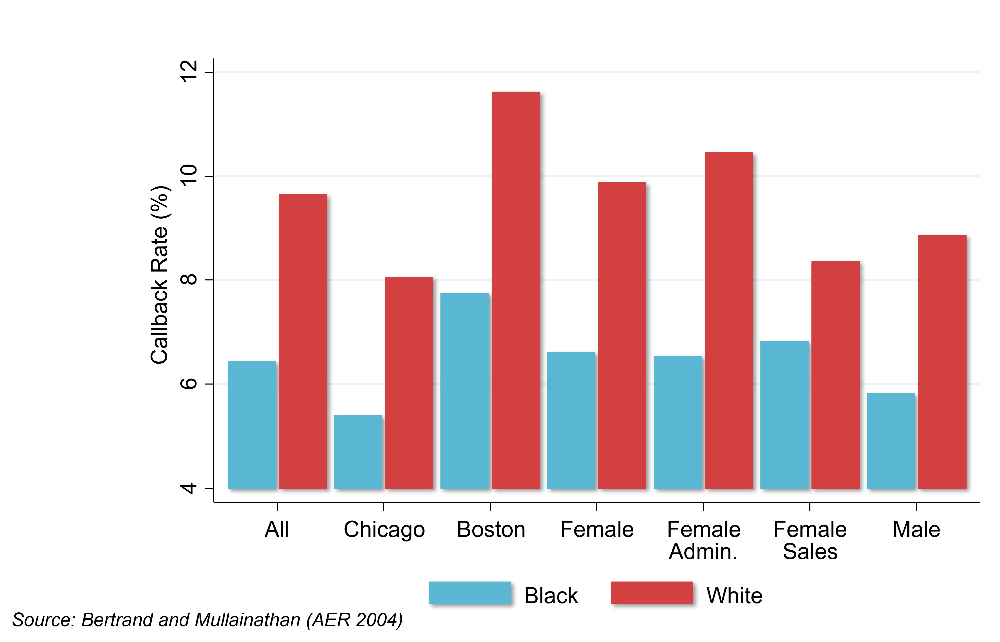
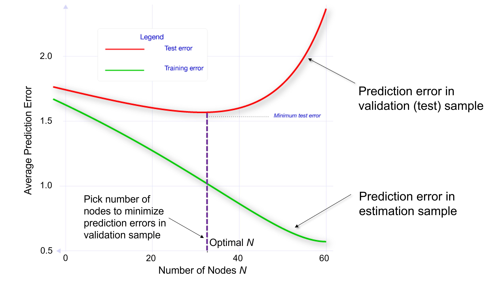

# Improving Judicial Decisions {#lec10_criminal-justice}

## Motivation: Bias in Human Decision Making

- Marianne Bertrand and Sendhil Mullainathan sent out fictitious resumes with identical credentials in response to real job ads (audit study). 
   - They searched a database of names from social security and get predictions of the probability that someone is black or white based on their name. They varied the name of the applicant on the resume to be either white-sounding (Emily Walsh), versus black-sounding (Lakisha Washington).
   - They sent 5,000 resumes in response to 1300 real “Help Wanted” ads in newspapers in Boston and Chicago. 

```{r , echo=FALSE, out.width = '90%'}

```

- This is a randomized trial. The resumes are identical in everything including education and work history, except for the name. So you're seeing whether the name matters, presumably because people are making an inference about race from that name. 
- A simple comparison of callback rates: systematically across all different groups, in Chicago, in Boston, among women, and among men, there are always significantly higher callback rates for white-sounding names than black-sounding names. 
   - The callback rate for white-sounding names is around 50% higher than for black-sounding names. 
   - There's very clear evidence of discrimination by race, conditional on credentials in the labor market. 
- Ben Edelman and peers use an audit study approach to analyze discrimination among Airbnb hosts. 
   - Sent out fictitious requests to book listings in response to real postings. Randomly varied the name of the applicant across the fake accounts to be white or black-sounding. They didn’t include profile pictures in these accounts so that the only information one can use to infer race comes from the names. This is a randomized trial. 
- Airbnb hosts are more likely to respond if someone has a white-sounding name than a black-sounding name to various degrees. These degrees vary from an outright "Yes, you can rent my house." to a, "No." There's a significantly higher rate of a straight "No." for black American guests than white guests. 
- Roughly 40% of these listings remained vacant on the date that they had proposed to visit the house. People are losing money by not accepting these invitations. 
   - On average, by rejecting black guests, Airbnb hosts are losing about $65 to $100 of revenue. This is systematic bias and bias in decision making. It could be driven by subconscious mistakes or deliberate racial discrimination. 
- Danziger et al. analyze data on judges’ decisions to grant prisoners parole in Israel. 
   - Judges review about 20 cases on average each day in succession. The order in which these cases appear before a judge is essentially random. There are two breaks during the day, during which the judges take meals. 

```{r , echo=FALSE, out.width = '90%'}
knitr::include_graphics("images/lec10_criminal_justice/danzinger1.png")
```
 
- If you happen to be the person who came up right before the judges broke for their snack, your odds of getting parole are almost zero. It then jumps up to 60% immediately after that meal break, and then it comes down again. After the lunch break, it goes up again and then comes back down. 
   - The rate changes from about 60% down to 10%: shockingly large. 

##	Decisions to Jail vs. Release Defendants

- After arrest, judges decide whether to hold defendants in jail or to let them go on bail. By law, the objective is to minimize the risk of flight, or the failure to appear at the trial. Kleinberg et al. compare machine learning predictions and judges’ actual decisions on bail in terms of performance in minimizing flight risk. 
- Kleinberg et al. have access to the same data that judges get when making these decisions, like the rap sheet. They then use data on subsequent crimes: whether or not people show up for the trial. They observe that outcome for the people who were released in order to evaluate the performance for their algorithm and compare it to judges’ actual decisions. 
- Kleinberg et al. define crime as failing to show up at the trial. The objective is to jail those with the highest risk of committing this crime. The clear objective helps the analysis. 

##	Data Used for Empirical Analysis

```{r , echo=FALSE, out.width = '90%'}
knitr::include_graphics("images/lec10_criminal_justice/kleinberg1.png")
```
 
 
- You start out with your set of data (left side of this flow chart). You then break it into three sets. 
- Middle set: the training set. That is the data that you use to actually fit your crime prediction model (80% of the data). 
- Lock Box: before they get to the training set, they take part of the data and put it in what they call a Lock Box. That's data that's not touched and is used later after you're done with the paper to evaluate whether your model is actually working as you had hoped. The big risk here comes from overfitting. 
   - If I give you lots of variables to predict something and you have a certain amount of data, you're always going to be able to design a model that works well within that data. But, you're not going to have any confidence in whether the model is going to predict well when faced with a new set of data, like a new set of defendants who appear. 
- Hold-Out sample: you start with all the data, set aside the Lock Box, put 80% of what remains in the training set, and then keep 20% in what they call a Hold-Out sample, which is the sample that they use to compare the decisions that judges make with the decisions that you would get from the machine learning prediction model. 
   - You need to use a different set of data from the data that you used for training the model, otherwise, it's going to be completely circular. If you're using the same data to evaluate the performance of your model and estimate it, the model's going to look like it performed very well because you used it to fit the exact same data. 
- 5-fold Cross-Validation: within the training data set, they've split it into five separate groups of 20% each (Folds of the Data). They estimate the model on four of these folds and then evaluate the predictions on the fifth fold until they optimize their model. 

##	Methodology

- Decision trees: split the data using a tree structure in order to form these predictions. Avoid overfitting the data, given that you have a very large number of potential predictors. 
   - You can get very good in-sample fit within a given set of data but still have very poor performance out-of-sample. Solve overfitting with cross-validation.
- Split the data based on the variable that is most predictive of differences in the outcome that you care about (crime rates). 
   - Imagine you have 10 different variables, such as the arrest charge, the defendant's age, their gender, where they're from, and their prior criminal background. 
   - Take each of these 10 variables and imagine splitting the data on the basis of that variable. Which variable creates the biggest difference between the two groups in terms of the probability that the defendant appears at the trial or doesn't appear at the trial? Start at the first node of the decision tree by splitting on the variable that is most predictive. 
- Repeat that process, growing the tree up to a given number of nodes. 
   - I've split the data into these two groups. I do the same exercise within each of the two groups. Looking in just the felony category, I determine which variable is most predictive of the probability of not showing up at the trial among the people who've committed felonies. 

```{r , echo=FALSE, out.width = '90%'}
knitr::include_graphics("images/lec10_criminal_justice/tree3.png")
```
 
- At each point we're going to make a split based on the variables we have. We keep growing this tree up to n nodes, or levels in the tree. 
- Cross validation helps answer where do you want to stop and how many layers do you want in your tree. 
   - Use the separate validation sample to evaluate the accuracy of the predictions based on a tree of a given size n. You might build a tree with five, ten, or twenty nodes within four folds of your training data. Take the fifth fold, the data that you haven't used in that estimation step and ask how well your tree of size n is doing at making predictions. 
   - If you have a tree that's too deep, the predictions are actually worse past some point. Repeat with trees of different depths and choose the optimal depth. 
- Red curve (below): shows how the prediction error changes as they make that tree bigger and bigger. 
   - Prediction error: the model spits out a prediction of whether or not the defendant is going to appear at trial, and you can compare that to whether or not the defendant appears at trial in the actual data. 
   - Initially, the prediction error is falling as they make the tree bigger. A tree depth around 35 minimizes the prediction error.
   - Overfitting: if you go beyond that with a deeper tree, you have higher prediction errors. 
 
```{r , echo=FALSE, out.width = '90%'}

```

- Green curve: if instead, you looked at prediction errors within the sample that you used for estimation, as you add more information, you start to fit the observations that you're trying to predict in that estimation sample better and better. 
   - Prediction error is constantly decreasing. If I'm trying to predict 1000 observations, and I give you more variables, you're going to do a better job predicting those 1000 observations. 
   - That is the wrong notion of prediction error to use when trying to figure out what will happen out of sample. Use the cross-validation approach where you estimate on part of the data and then calculate the prediction errors using a different part of the data. 

##	Comparing Machine Predictions to Human Predictions

- Kleinberg et al fit the model and get a prediction for every defendant on the probability that they're going to show up at the trial. 
- The decision rule, if you're just using the machine predictions, is a simple threshold, above which everyone is jailed, and below which everyone is granted parole. 

```{r , echo=FALSE, out.width = '90%'}
knitr::include_graphics("images/lec10_criminal_justice/kleinberg6.png")
```
 
- 3D plot: the predicted crime risk from the model is on the horizontal axis. They also show the the observed crime rate, whether or not people actually showed up. Lastly, the decision that is being made in terms of the release rate is shown on the vertical axis. 
- The relationship between predicted crime risk and observed crime rate is on the plane at the bottom. Those shadowy dots there are a projection of the 3D plot onto the two dimensions. 
   - Predicted crime risk and observed crime rate are very closely related to each other (you only see the observed crime rate for the defendants who are released). You've built a good machine learning model that seems to work out of sample. 
- The plane showing the release rate and predicted crime risk shows that judges release about 50% of the defendants whose predicted crime risk exceeds 60%. 
   - Dots near the blue arrow: we think there's a 60% chance these people are not going to show up for trial if you release them. However, the judges’ release rate for that group is around 50%. 
   - People who have very low predicted crime risk (less than 20%), 30% of those folks are being jailed. 
- Key takeaway: if judges were following the machine learning predictions closely, they would be very unlikely to release the guys with high predicted crime risks and very likely to release the guys that have a low predicted crime risk. 
   - Judges are releasing lots of people they probably shouldn't be and jailing lots of people who could probably be safely let go. 
   - By swapping low and high-risk defendants, crime could be reduced by 25% with no change in jailing rates if you used the machine learning predictions instead of the judges’ current decisions. Or you could reduce the number of people that you currently hold in jail by 42%, keeping fixed the current rate of crime. 
- Why does the machine significantly outperform judges?
   - Limits to human cognition: decision fatigue.
   - Judges see how someone is acting in a courtroom, which they may use to inform their decision, but which may not actually be that predictive of whether they’re going to commit a crime. 
   - Probably too extreme to say we should replace judges with these models and make decisions purely on that basis. However, there are people designing software that gives the judge a score that is the predicted risk for the defendant. Judges then can choose to deviate from that score if they want. 

##	Predictive Policing

- Predict and prevent crime before it happens.
- An area level approach makes sense fundamentally because there tends to be a clustering of criminal activity by place and time. Plot a frequency distribution of the time between burglaries that are separated by .1 miles or less. 
- To think about this mechanically, suppose you take a .1-mile radius in a neighborhood in which a crime occurred on January 1st, how likely was it that there was also a burglary that also occurred on January 2nd, 3rd, or 4th? How large is the gap between two burglaries, and what is the empirical distribution of those gaps? You can see here that there is a sharp spike at zero and one. When there's a burglary on a given day, it's very likely that there's another burglary in that same neighborhood on that same day or the next day. There's a type, spatial, and temporal clustering of crime. 

```{r , echo=FALSE, out.width = '90%'}
knitr::include_graphics("images/lec10_criminal_justice/mohler1.png")
```
 
 
- Why is that?
   -  It could be that the same set of people burglarize multiple houses or that there's some kind of correlation in criminal activity that occurs in given places and given times. 
- Why is this useful? 
   - This suggests that you might be able to detect where these hotspots of crime are going to occur. That potentially motivates spatial tools that are oriented around detecting crime at high frequencies in certain areas. 
   - An example of a technique like that is a database called ShotSpotter. When there are gunshots, there's a very distinctive audio signal that you can pick out from some distance. There are police departments around the country that have set up sensitive microphones on top of buildings that will detect gunshots. You can aggregate that data and figure out when there are gunshots being fired through the signature. Again, it's similar to using a machine learning algorithm to pick out what seems like a gunshot. That can give you high frequency data on where crime is potentially occurring.
   - You might ask, why don't you just wait for people to self-report a gunshot? If you look at these sorts of data, you see that a huge number of incidents of gunshots are not reported. In fact, a very small fraction is reported. Therefore, this type of information from machine learning can be potentially useful in predicting where additional crime might occur given spatial clustering. That's one approach to predictive policing. 
- You can think of the second approach as individual level methods, which are potentially even more powerful. We don't just rely on where you are or aggregate data by area. Instead, we use information on individual characteristics like people's background, social networks, and behaviors. 
   - As an example, if you see that kids who have certain profiles in school, like those who have been suspended many times or have gotten expelled, you might be able to fit a machine learning model and see which types of children have certain behavioral patterns associated with crime down the road. That can give you predictions of the types of subgroups where you might be more worried and to which you might allocate resources to try to prevent crime. The methods there are quite similar conceptually to the methods discussed in the other application, so I'm not going to show those examples here. 

##	Conclusion

- Even if you're able to build them, it’s not always completely clear when to implement them. There's a serious ethical debate about the use of predictive analytics in settings like this.
- There are two prominent views, both of which are reasonable depending on your point of view.
- One view questions whether a person should be treated differently simply because they share attributes with others who have higher risks of crime. 
   - An extreme version of this is that there are sharp differences in terms of the rate of incarceration by race. In particular, black men are incarcerated at much higher rates than other groups. 
   - As you can imagine race is potentially going to be a powerful predictor of crime and incarceration in models like this. Even if you were to explicitly exclude race from your prediction model, typically variables that are correlated with race, like zip code, will start to become predictors.
   -  Then, effectively what you're doing is treating people differently on the basis of race just because they happen to share a race with somebody else. You might be subjecting them to more policing or a different set of interventions, which of course is at some level unfair given that they haven't done anything yet. Thus, I think that's a serious ethical concern with using these sorts of prediction tools. 
- On the flip side, I think you can also ask if police, judges, and decision-makers should discard information that could make society fairer and potentially more just than it is now on average. 
   - You could potentially target your resources much better with the use of these prediction tools as we saw in the judge example.
   -  It's true that you're treating people differently on the basis of their attributes, but if you think about it from the perspective of the ends not the fairness of the process, maybe the outcomes that you achieved are better overall. 
   - This is not completely clear. There's an interesting set of literature developing on fairness and algorithms that tries to get at these ethical issues, think rigorously about which algorithms are fair or less fair, and precisely quantify it. 
