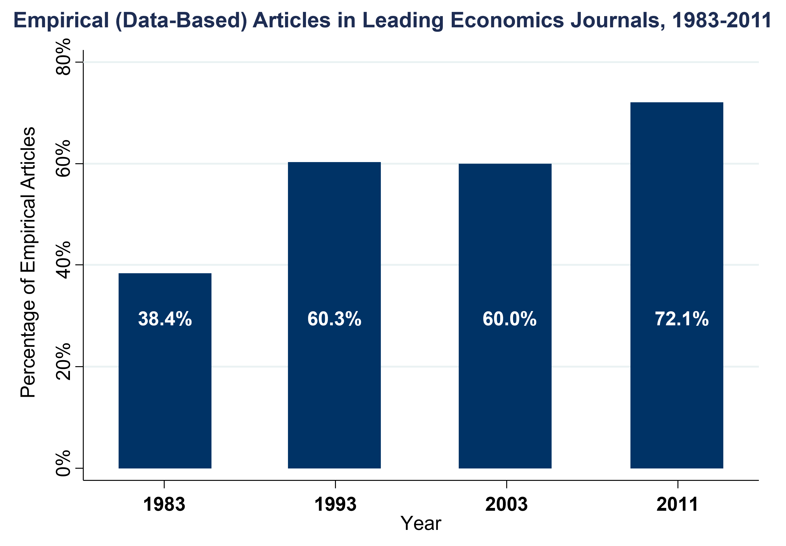

--- 
title: "Economics of Public and Social Issues"
subtitle: "ECO 3253 – Spring 2026"
author: "Jonathan Moreno-Medina"
date: "`r Sys.Date()`"
site: bookdown::bookdown_site
documentclass: book
bibliography: [book.bib, packages.bib]
# url: your book url like https://bookdown.org/yihui/bookdown
# cover-image: path to the social sharing image like images/cover.jpg
description: |
  This is the website for the course ECO 3253 at UTSA, taught in the Spring of 2026. 
link-citations: yes
github-repo: jrm87/ECO3253_spring2026
---

# About {-}

Welcome to ECO 3253!

In this course we will see how we can use **data** to understand and solve current and important **economic problems**! You will get a sense of what is the research frontier in applied economics and social science. These include topics like *equality of opportunity and mobility*, *education*, *innovation* and *entrepreneurship*, *health care*, *climate change*, and *crime.* How will we get there? By doing 3 things:

1. covering the topics with a focus towards using data that can help answer these questions
2. understanding the intuition for how to use data to answer these questions (basics of statistical analysis)
3. using computational tools to help us with the statistical analysis (basics of R)

## About me {- #aboutme}

Let me briefly tell you about me: 

I am Colombian. Did my PhD in Economics at [Duke University](https://econ.duke.edu/), a Masters in Economics at [Université Catholique de Louvain](https://uclouvain.be/en/faculties/espo/esl) in Belgium, and an undergraduate in (you guessed it!) Economics at [Universidad Nacional de Colombia](https://unal.edu.co/). 

I am an applied (micro)economist. What is applied microeconomics? Well, first what I do not work on: macroeconomics (inflation, general unemployment, GDP growth, and so on). The 'micro' part just means I tend to focus on specific markets (housing and media, being the main ones), and the 'applied' just means I use data all the time in my research. Which leads me to my next point.

## Organization of this site {-}

In this site I will put the materials we cover in the lectures so you can refer to it later on your own. 

I will divide this 'book' into **two main parts**: economic content, and the tools. The tools are both 'statistical' (correlations, means, distributions, etc) and 'computational' (**R**). The content of the course is already posted, but as we go thrugh the semester it is likely that I will update some of the notes for the lectures we go through in that week.  

There is also an [Appendix](#appendixA), which you will be able to see on the bottom of the navigation panel, where I will post complementary material where you could brush up several statistical concepts, for example. 

Lastly, I will also leave a link to the [projects](#projects) you will work on this semester at the end of the list on the left. 

## Data-driven course {-}

We will work with data throughout the semester! This will not just be a 'theoretical' course. We will work with real world data, and we will try to make sense of it. We will need theoretical to make sense of the world for sure (either coming from economics or statistics), but we are looking at those tools always eyeing real world instances. The course here presented is partly based on the [course](https://opportunityinsights.org/course/) by [Prof. Raj Chetty](https://rajchetty.com/) at Harvard. As we will see later, I also rely on some material on the book [ModernDive](https://nulib.github.io/moderndive_book/index.html) for teaching the basics of our statistical software **R**.

Just to give you a sense of how much economics has became a much more empirical discipline in later years, below is the number of articles in leading journals that are data-drive in a way. 

```{r fig_econJournals, fig.cap="Source: Mamermesh (JEL 2013)", echo=FALSE, out.width = '90%'}

```

Hence, you will learn to work with data to better think about social and economic issues. Fortunately, **the same types of skills that you will acquire for this course are also used by large private companies to navigate their own markets**. That is, the skills folks are places like Amazon, Google, or Microsoft might use to navigate analysis of their own market and data are in many ways the same skills that you would need to understand data in tackling challenges like growing inequality and climate change. 

In order to achieve that goal, the idea of this class is to introduce a broad range of topics, methods, and real-world applications of these sorts of ideas. Fundamentally, we want to start from the questions that motivate the methods we teach in economics and social science, rather than the traditional approach, which is to do the reverse.

## Topics to be covered {-}

The plan for what we will covered in the semester includes:

- Geography of Upward Mobility in America
- Causal Effects of Neighborhoods and Characteristics of High-Mobility Areas 
- Historical and International Evidence on the Drivers of Inequality and Mobility
- Upward Mobility, Innovation, and Growth
- Higher Education and Upward Mobility
- Primary education
- Teachers and Charter Schools
- Racial Disparities in Economic Opportunity
- Improving judicial decisions
- Immigration 
- Political Economy
- Income taxation
- Savings and wealth
- Housing markets and COVID
- Intro to air and water pollution, and externalities
- Discount rates, external validity

You can check the [Schedule](#schedule), or for more details, please check the syllabus on Canvas. 

## Statistical tools {-}

Although we are going to take a topic-oriented focus in this class, we will cover the basics of several methods that will help us make sense of the data. These methods include: 

1.	Descriptive Data Analysis: correlation, regression
2.	Experiments: randomization, non-compliance
3.	Quasi-Experiments: regression discontinuity, difference-in-differences
4.	Machine Learning: prediction, overfitting, cross-validation
5.	**R** as our statistical software

## Economic Concepts {-}

We will cover and make use if several economic concepts you probably learned in your intro classes, but we will see several instances of how to use it practice. These include:

1.	Effects of price incentives
2.	Supply and demand
3.	Competitive equilibrium
4.	Adverse selection
5.	Behavioral economics vs. rational models

## Projects {-}

**This is very important!** A big part of the course will be the projects you will do during the semester. You will work on **4 projects** through the semester. These are more involved than most homeworks you have probably worked up to now. The good news is that they involve doing economics! You will get hands-on experience working with real data on real problems. 

The main recommendation is to start working on this projects **early**! I cannot emphasize this enough. There are several moving parts to these projects, and you need to plan in advance your work so you can try, fail, come back to it, and so on. If you try to work on these projects just the night before the deadline, that will not leave much room for experimenting, and trying. Given than several of these tools might be new, you need to give yourself time to try more than once. 

:::: {.blackbox data-latex=""}
::: {.center data-latex=""}
**Important!**
:::

Do not work on these projects just the day before! They are relatively involved, so give yourself enough time. 
::::

For more details, please check the syllabus on [Schedule](#schedule) and on Canvas. 

## FAQs {-}

1. Do I need to know how to program?

No! I will give you the basic tools to understand and do basic analysis in R even if you have no background in this sort of things. 

2. Do I need to have taken econometrics? 

No. You will have a bit of a head start if you have, but you do not have to have taken the econometrics course to be successful in this class. I will give you some of the basic conceptual frameworks for how we think about statistical analysis and causal inference.

3. Do I need to know statistics? 

Basic statistics is definitely recommended. We will have plenty of opportunity to brush up some of those concepts throughout the course, though. You can find a refresher in the [Appendix](#appendixA)

4. Where can I find more details about this class? 

You can read more in the syllabus uploaded to Canvas. 


```{r include=FALSE}
# automatically create a bib database for R packages
knitr::write_bib(c(
  .packages(), 'bookdown', 'knitr', 'rmarkdown'
), 'packages.bib')
```
