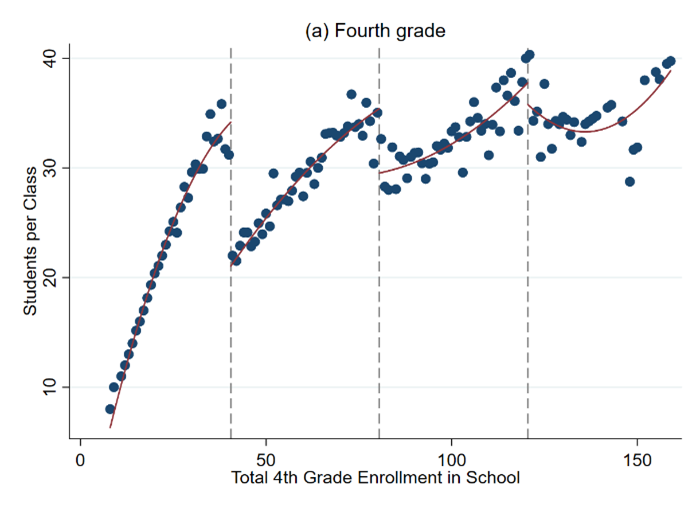

# Project 2 {- #project2}

## Do Smaller Classes Improve Test Scores? Evidence from a Regression Discontinuity Design {-}

- **Posted**: Wednesday, August 28, 2024

- **Due**: At midnight on Tuesday, October 11, 2024

In this empirical project, you will use a regression discontinuity design to estimate the causal effect of class size on test scores. To answer some of the questions, you will need to refer to the following papers:

1.	[Chetty, Raj, John N. Friedman, Nathaniel Hilger, Emmanuel Saez, Diane Whitmore Schanzenbach, and Danny Yagan. 2011. “How Does Your Kindergarten Classroom Affect Your Earnings? Evidence from Project STAR,” Quarterly Journal of Economics 126(4): 1593–1660.](https://opportunityinsights.org/wp-content/uploads/2018/03/star_paper.pdf) 

2.	[Angrist, Joshua D., and Victor Lavy. 1999. “Using Maimonides’ Rule to Estimate the Effect of Class Size on Scholastic Achievement,” Quarterly Journal of Economics 114(2): 533–575.](http://piketty.pse.ens.fr/files/AngristLavy1999.pdf)

The data file `grade5.rds` consists of test scores in fifth grade classes at public elementary schools in Israel. These data were originally used in Angrist and Lavy (1999). The graphs below were drawn using the same data.

```{r , echo=FALSE, caption="Class Size as a Function of Total School Enrollment in Public Schools in Israel - Forth Grade", out.width = '90%'}

```

```{r , echo=FALSE, caption="Class Size as a Function of Total School Enrollment in Public Schools in Israel - Fifth Grade", out.width = '90%'}
knitr::include_graphics("images/project2/angristlevy99_2.png")
```

> Note: These figures plot class size as a function of total school enrollment for fourth grade and fifth grade classes in pubic schools in Israel in 1991

## Instructions {-}

You will work on Posit Cloud for this project. Write the replication within a Quarto/RMarkdown file in the **project2** tab in Posit Cloud.

Recall that I created a Section to help you get up to speed with [Quarto/RMarkdown here](#rmarkdown). The Quarto/RMarkdown file is where you will write your report, run all your analysis, and the output of each code block should be visible. The output should include references, graphs, maps, and tables. 

## Questions to address in your replication {-}

1.	Explain why a simple comparison of test scores in small classes versus large classes would not measure the causal effect of class size.  Would this simple comparison likely be biased upwards or biased downwards relative to that true causal effect?  Explain. 

2.	(To answer this and the next question, read [Chetty et al. 2011](https://opportunityinsights.org/wp-content/uploads/2018/03/star_paper.pdf)).  How did the Tennessee STAR experiment overcome this problem?  What did it find?

3.	Figures like Figure 1 above are called binned scatter plots. They are built by averaging the value of a variable at evenly spaced bins of the running variable (the variable for which the discontinuity happens). 

We will construct a graphical regression discontinuity analysis, focusing on the 40 student school enrollment threshold.  See Table in the [Data Description Section](#descriptionproject2) and the [cheat sheet](#cheatsheetproject2) for more guidance.  

    a. Draw a binned scatter plot to visualize how class size changes at the 40 student school enrollment threshold.  Display a linear or quadratic regression line based on what you see in the data.  

    b. Draw binned scatter plots to visualize how math and verbal test scores change at the 40 student school enrollment threshold.  Display a linear or quadratic regression line based on what you see in the data.  

    c. Draw binned scatter plots to test whether (i) the percent of disadvantaged students, (ii) the fraction of religious schools, and (iii) the fraction of female students evolve smoothly across the 40 student school enrollment threshold.  Display a linear or quadratic regression line based on what you see in the data.  

    d. Produce a histogram of the number of schools by total school enrollment.  Note that you must collapse the data by school to produce this graph.  

4.	Regression analysis.  Run the regressions that correspond to your three graphs in 3a and 3b to quantify the discontinuities that you see in the data.  In estimating these regressions, use all the observations with school enrollment less than 80.  Report a 95% confidence interval for each of these estimates.  See Table in the [Data Description Section](#descriptionproject2) and the [cheat sheet](#cheatsheetproject2) for more guidance.

5.	Recall that any quasi experiment requires an identification assumption to make it as good as an experiment.  What is the identification assumption for regression discontinuity design?  Explain whether your graphs in 3c and 3d are consistent with that assumption.  
 
6.	(To answer this question, read [Angrist and Lavy (1999)](http://piketty.pse.ens.fr/files/AngristLavy1999.pdf)). If all schools followed the class size rule exactly as described in Angrist and Lavy (1999), how much would you expect class size to change at the 40 student enrollment threshold? Explain why the actual change in class size that you see in the data is less than this.  

7.	Suppose your school superintendent is considering a reform to reduce class sizes in your school from 40 to 35. Use your estimates above to predict the change in math and verbal test scores that would result from this reform. 

>**Hint**: divide the RD estimate of the change in test scores by the change in number of students per class at the threshold. 

8.	Now suppose you are asked for advice by another school that is considering reducing class size from 20 to 15 students – a 5 unit reduction as above.  Would you feel confident in making the same prediction as you did above about the impacts this change will have?  Why or why not?

9.	Compare your estimates in 7 with the estimates from the Tennessee STAR experiment (Chetty et al. 2011). Give two reasons that your estimates might differ from those of these other studies.

10.	Chetty et al. (2011) show that being assigned to a smaller class in Kindergarten raises Kindergarten test scores, but has little impact in later grades. Does this “fade out” effect mean that class size doesn’t really matter in the long run?  Why or why not?

11.	Given the evidence above, would you encourage your hometown school to reduce class size by hiring more teachers if the goal is to maximize students’ long-term outcomes (e.g., college attendance rates, earnings)?  Explain clearly what other data you would need to make a scientific recommendation and how you would use that data. 


***

## Data Description {- #descriptionproject2}

The file `grade5.rds`consist of n = 2,019 fifth grade classes at 1,002 public schools in Israel in 1991.  For more details on the construction of the variables included in this data set, please see [Angrist and Lavy (1999)](https://economics.mit.edu/files/8273).

**Table 1**

Definitions of Variables in `grade5.rds`

```{r tableGrade, echo=FALSE, message=FALSE, warnings=FALSE, results='asis'}
tabl_grade <- "
|    **    Variable   **   |                                                                                                                                          **    Label   **                                                                                                                                          |
|------------------------|--------------------------------------------------------------------------------------------------------------------------------------------------------------------------------------------------------------------------------------------------------------------------------------------------|
|            (1)           |                                                                                                                                                 (2)                                                                                                                                                |
|     schlcode             |     School id code                                                                                                                                                                                                                                                                                 |
|     school_enrollment    |     Total school enrollment in fifth grade                                                                                                                                                                                                                                                         |
|     grade                |     Class grade     5 = fifth grade for all observations in grade5.dta                                                                                                                                                                                                                             |
|     classize             |     Number of students in the class                                                                                                                                                                                                                                                                |
|     avgmath              |     Average composite year-end math score in the class,   on a scale of 1 to 100, from a national elementary school test.                                                                                                                                                                          |
|     avgverb              |     Average composite year-end verbal score in the   class, on a scale of 1 to 100, from a national elementary school test.                                                                                                                                                                        |
|     disadvantaged        |     Percent of class coming from a disadvantaged   background, as defined by an index used by the Ministry of Education to   allocate supplementary hours of instruction and other school resources.  The index is based on fathers’ education,   fathers’ continent of birth, and family size.    |
|     female               |     Fraction of students in the class that are female                                                                                                                                                                                                                                              |
|     religious            |     1 = School is a religious public school     0 = School is a secular public school                                                                                                                                                                                                              |
"
cat(tabl_grade) # output the table in a format good for HTML/PDF/docx conversion
# link: https://www.tablesgenerator.com/markdown_tables
```

***

## Cheatsheat commands  {- #cheatsheetproject2}

### R command	Description {-}

Here I present a summary of the commands you could use to work on this project. There are two important issues you should keep in mind while reading this: 

1. Notice that whenever you see `yvar` this is **not a real variable**. As in Project 1, it is only a place holder for the appropriate variable that you decide to analyze or use. 

:::: {.blackbox data-latex=""}
::: {.center data-latex=""}
**Important!**
:::

**'yvar'** is not a real variable. You should replace it for the appropriate variable in your code.
::::

###  Packages needed {-}

You should use the usual packages for data wrangling and visualization:

```{r, eval=FALSE}
library(tidyverse)
```

Additionally, we will use the following packages for the estimation of the Regression Discontinuity Design (remember that if this code does not run, you need to install the library first): 

```{r, eval=FALSE}
library(rdrobust)
```

### Subset observations {-}

If you want to subset the data for schools with enrollment between 20 and 60 and create a dataset from those observations, you would do the following: 

```{r, eval=FALSE}
narrow_data <- grade5%>%
  filter(school_enrollment <= 60 & school_enrollment >= 20)
```

### Draw binned scatterplots {-}

For the plot with a linear fit, we will use the function `rdplot` from the `rdrobust` package. The following command produces a binned scatter plot of `yvar` against the total school enrollment with a linear best fit line, restricting the graph to observations with total school enrollment in [20,60].  You can do so by doing this: 

```{r, eval=FALSE}
rdplot(narrow_data$yvar, narrow_data$school_enrollment, c = 40.5, p = 1, nbins = 20)
```

For the plot with a quadratic fit, you can similarly do this, now changing the option `p` from `1` to `2`: 

```{r, eval=FALSE}
rdplot(narrow_data$yvar, narrow_data$school_enrollment, c = 40.5, p = 2, nbins = 20)
```

### Collapse or summarize datasets {-}

The next two commands show how to create a graph showing the number of schools that have each value of `school_enrollment`.

First, we collapse the data to convert from school-grade level data to school level data. 

You can create datasets that are based on summaries of other data. For example, to create a dataset by school instead of by grade (as the original `grade5.rds` is), you can use the function `group_by` and select the variables that you want to use for the summary, proceeded by the function `summarise`, in which you include the specific statistic you want to create. Int he following example, we want the average of the variable `school_enrollment` by school:

```{r, eval=FALSE}
narrow_data_school <- narrow_data%>%
  group_by(schlcode)%>%
  summarise(school_enrollment = mean(school_enrollment, na.rm = TRUE))
```
> Notice that we used the `na.rm=TRUE` option to avoid any complications coming from missing values.

### Draw graph of count of schools {-}

Second, we draw a graph of the counts of schools, restricting the graph to schools with between 20 and 60 students enrolled.

Here we draw a graph of the counts of schools with the package `ggplot2` (which is loaded by `tidyverse`), restricting the graph to schools with between 20 and 60 students enrolled:

```{r, eval=FALSE}
ggplot(narrow_data_school, aes(school_enrollment)) +
  geom_histogram(bins = 40) +
  geom_vline(xintercept=40.5,  color = "red") 
```


### Estimate the discontinuity {-}

These commands show how to run a regression to quantify the discontinuity in `yvar` at the 40 student threshold. We first subset the data to observations with `school_enrollment` between 0 and 80. 

```{r, eval=FALSE}
grade_u80 <- grade5%>%
  filter(school_enrollment <= 80)
```

Next we generate an indicator variable (that is a variable that is either equal to `1` when the condition is true, or `0` when it is not) for `school_enrollment` being above 40.

```{r, eval=FALSE}
grade_u80 <- grade5%>%
  mutate(above40=(school_enrollment > 40))
```

You can verify that `above40` is only equal to `1` when `school_enrollment` is greater than 40.

We then generate a variable that equals `school_enrollment` minus 40, and the interaction term between this variable and the indicator for `school_enrollment` being above 40. 

```{r, eval=FALSE}
grade_u80 <- grade_u80%>%
  mutate(x=school_enrollment - 40,
         x_above = above40*x)
```

Finally, we run a linear regression of `yvar` on these three variables, restricting the regression to observations with `school_enrollment` between 0 and 80 (we will call this model `mod1`). 

```{r, eval=FALSE}
mod1 <- lm(yvar~above40 + x + x_above, data = grade_u80)
summary(mod1)
```

### Interpretation {-}

The coefficient on `x_above` is the estimate of the discontinuity in `yvar` at the threshold. You can also see the p-values in the table to see if there is evidence of a statistical jump or not. Recall that we interpret that there is evidence of such a jump if the p-value is below 0.05.

For more on regressions, see Section \@ref(regression). For more on data visualization, see Section \@ref(viz). For more on data wrangling, see Section \@ref(wrangling). 

